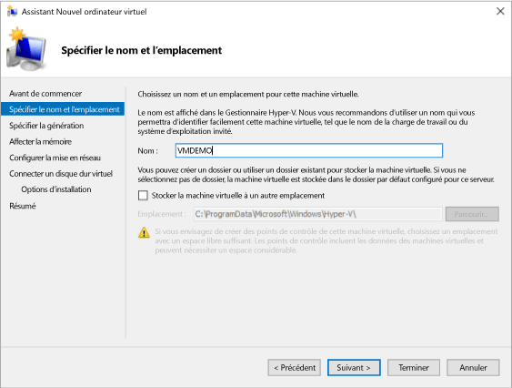
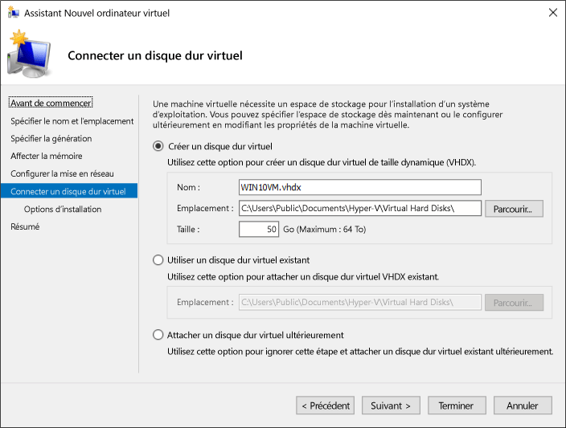

# <a name="create-virtual-machine-with-hyper-v-on-windows-10"></a>Créer une machine virtuelle avec Hyper-V sur Windows10

Découvrez comment créer une machine virtuelle et y installer un système d’exploitation.  Vous aurez besoin d'un fichier .iso du système d’exploitation que vous souhaitez exécuter. Si nécessaire, téléchargez une copie d’évaluation de Windows10 à partir du [Centre d’évaluation TechNet](http://www.microsoft.com/evalcenter/).

## <a name="create-a-virtual-machine-with-hyper-v-manager"></a>Créer une machine virtuelle avec le Gestionnaire Hyper-V

1. Ouvrez le Gestionnaire Hyper-V soit en appuyant sur la touche Windows et en tapant «Gestionnaire Hyper-V», soit en recherchant **Gestionnaire Hyper-V** dans vos applications.

1. Dans le Gestionnaire Hyper-V, cliquez sur **Action** > **Nouveau** > **Ordinateur virtuel** pour ouvrir l’Assistant Nouvel ordinateur virtuel.

1. Passez en revue le contenu de la section «Avant de commencer», puis cliquez sur **Suivant**.

1. Attribuez un nom à la machine virtuelle.
  > **Remarque:** Il s’agit du nom utilisé par Hyper-V pour la machine virtuelle, et non pas du nom d’ordinateur attribué au système d’exploitation invité qui sera déployé dans la machine virtuelle.

1. Choisissez un emplacement dans lequel stocker les fichiers de la machine virtuelle, par exemple **c:\virtualmachine**. Vous pouvez aussi accepter l’emplacement par défaut. Quand vous avez terminé, cliquez sur **Suivant**.
    
  

1. Sélectionnez la génération de la machine, puis cliquez sur **Suivant**.  

  Introduites avec Windows Server2012R2, les machines virtuelles de génération2 fournissent un modèle de matériel virtuel simplifié et des fonctionnalités supplémentaires. Vous pouvez uniquement installer un système d’exploitation 64bits sur une machine virtuelle de génération2. Pour plus d’informations sur les machines virtuelles de génération2, voir [Vue d’ensemble des machines virtuelles de génération2](<https://docs.microsoft.com/previous-versions/windows/it-pro/windows-server-2012-R2-and-2012/dn282285(v=ws.11)>).
  
  > Si la nouvelle machine virtuelle est configurée comme étant de génération2 et exécute une distribution Linux, le démarrage sécurisé doit être désactivé. Pour plus d’informations sur le démarrage sécurisé, voir [Démarrage sécurisé](<https://docs.microsoft.com/previous-versions/windows/it-pro/windows-8.1-and-8/dn486875(v=ws.11)>).

2. Sélectionnez**2048**Mo comme valeur de **Mémoire de démarrage** et laissez l’option **Utiliser la mémoire dynamique** sélectionnée. Cliquez sur le bouton **Suivant**.

  La mémoire est partagée entre un hôte Hyper-V et la machine virtuelle en cours d’exécution sur l’hôte. Le nombre de machines virtuelles pouvant s’exécuter sur un seul hôte dépend en partie de la mémoire disponible. Vous pouvez également configurer une machine virtuelle de manière à ce qu’elle utilise la mémoire dynamique. Une fois activée, la mémoire dynamique récupère la mémoire inutilisée de la machine virtuelle en cours d’exécution. Cela permet d’exécuter davantage de machines virtuelles sur l’hôte. Pour plus d’informations sur la mémoire dynamique, voir [Présentation de la mémoire dynamique Hyper-V](https://docs.microsoft.com/previous-versions/windows/it-pro/windows-server-2012-R2-and-2012/hh831766(v=ws.11)).

3. Dans l’Assistant de configuration de la mise en réseau, sélectionnez un commutateur virtuel pour la machine virtuelle, puis cliquez sur **Suivant**. Pour plus d’informations, voir [Créer un commutateur virtuel](connect-to-network.md).

4. Nommez le disque dur virtuel, sélectionnez un emplacement ou conservez la valeur par défaut, puis spécifiez une taille. Quand vous êtes prêt, cliquez sur **Suivant**.

  À l’instar d’un disque dur dans un ordinateur physique, un disque dur virtuel fournit à la machine virtuelle un espace de stockage. Vous devez disposer d’un disque dur virtuel pour installer un système d’exploitation sur la machine virtuelle.
  
  

1. Dans l’Assistant Options d’installation, sélectionnez **Installer un système d’exploitation à partir d’un fichier image de démarrage**, puis sélectionnez le fichier.iso d’un système d’exploitation. Une fois l’opération terminée, cliquez sur **Suivant**.

  Quand vous créez une machine virtuelle, vous pouvez configurer certaines options d’installation du système d’exploitation. Les trois options disponibles sont les suivantes:

  * **Installer un système d’exploitation ultérieurement**: cette option n’apporte aucune modification supplémentaire à la machine virtuelle.

  * **Installer un système d’exploitation à partir d’un fichier image de démarrage**: cette option équivaut à insérer un CD dans le lecteur de CD-ROM physique d’un ordinateur physique. Pour configurer cette option, sélectionnez une image.iso. Cette image est montée sur le lecteur de CD-ROM virtuel de la machine virtuelle. L’ordre de démarrage de la machine virtuelle est modifié pour faire passer le lecteur de CD-ROM en première position.

  * **Installer un système d’exploitation à partir d’un serveur d’installation réseau**: cette option n’est accessible que si vous avez connecté la machine virtuelle à un commutateur réseau. Dans cette configuration, la machine virtuelle tente de démarrer à partir du réseau.

1. Passez en revue les détails de la machine virtuelle, puis cliquez sur **Terminer** pour terminer la création de la machine virtuelle.

## <a name="create-a-virtual-machine-with-powershell"></a>Créer une machine virtuelle avec PowerShell

1. Ouvrez PowerShell ISE en tant qu’administrateur.

2. Exécutez le script suivant.

  ``` powershell
  # Set VM Name, Switch Name, and Installation Media Path.
  $VMName = 'TESTVM'
  $Switch = 'External VM Switch'
  $InstallMedia = 'C:\Users\Administrator\Desktop\en_windows_10_enterprise_x64_dvd_6851151.iso'

  # Create New Virtual Machine
  New-VM -Name $VMName -MemoryStartupBytes 2147483648 -Generation 2 -NewVHDPath "D:\Virtual Machines\$VMName\$VMName.vhdx" -NewVHDSizeBytes 53687091200 -Path "D:\Virtual Machines\$VMName" -SwitchName $Switch

  # Add DVD Drive to Virtual Machine
  Add-VMScsiController -VMName $VMName
  Add-VMDvdDrive -VMName $VMName -ControllerNumber 1 -ControllerLocation 0 -Path $InstallMedia

  # Mount Installation Media
  $DVDDrive = Get-VMDvdDrive -VMName $VMName

  # Configure Virtual Machine to Boot from DVD
  Set-VMFirmware -VMName $VMName -FirstBootDevice $DVDDrive
  ```

## <a name="complete-the-operating-system-deployment"></a>Terminer le déploiement du système d’exploitation

Pour terminer la création de votre machine virtuelle, vous devez la démarrer et suivre les étapes d’installation du système d’exploitation.

1. Dans le Gestionnaire Hyper-V, double-cliquez sur la machine virtuelle. Cette opération lance l’outil VMConnect.

2. Dans VMConnect, cliquez sur le bouton vert Démarrer. Cela revient à appuyer sur le bouton Marche/Arrêt d’un ordinateur physique. Vous pouvez être invité à appuyer sur une touche quelconque pour démarrer à partir d’un CD ou d’un DVD. Dans ce cas, appuyez sur une touche pour continuer.

  > **Remarque:** Vous devrez éventuellement cliquer dans la fenêtre VMConnect pour vérifier que vos séquences de touches sont envoyées à la machine virtuelle.

3. Quand la machine virtuelle démarre, suivez les étapes du programme d’installation comme sur un ordinateur physique.

   

  > **Remarque:** Si vous n’exécutez pas une version avec licence en volume de Windows, vous devez avoir une licence distincte pour la copie de Windows s’exécutant sur une machine virtuelle. Le système d’exploitation de la machine virtuelle est indépendant du système d’exploitation de l’hôte.
