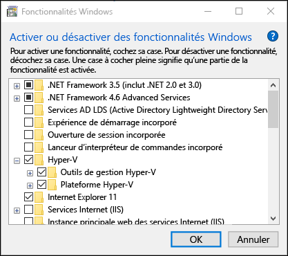
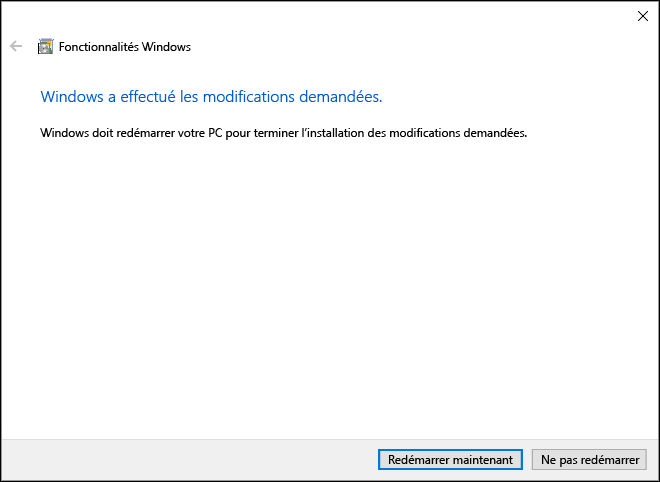

# Installer Hyper-V sur Windows 10

Activez Hyper-V pour créer des machines virtuelles sur Windows 10.  
Hyper-V peut être activé de nombreuses manières, y compris à l’aide du Panneau de configuration de Windows 10, de PowerShell (mon favori) ou de l’outil Gestion et maintenance des images de déploiement (DISM). Ce document présente chacune de ces options.

> **Remarque :** Hyper-V est intégré à Windows en tant que fonctionnalité facultative ; il n’est pas disponible en téléchargement ni sous la forme de composant installable. 

## Vérifier la configuration requise

* Windows 10 Entreprise, Professionnel ou Éducation
* Processeur 64 bits avec traduction d’adresse de second niveau (SLAT).
* Processeur prenant en charge les extensions de mode du moniteur de machine virtuelle (VT-c sur les processeurs Intel).
* Au minimum 4 Go de mémoire.

Le rôle Hyper-V **ne peut pas** être installé sur Windows 10 Famille.  
Mettez à niveau l’édition Windows 10 Famille vers Windows 10 Professionnel en ouvrant **Paramètres** > **Mise à jour et sécurité** > **Activation**.

Pour plus d’informations et pour connaître les étapes de résolution des problèmes, voir [Configuration requise pour Hyper-V sur Windows 10](../reference/hyper-v-requirements.md).


## Installer Hyper-V 
Hyper-V est intégré à Windows en tant que fonctionnalité facultative ; il n’est pas disponible en téléchargement ni sous la forme de composant installable.  Le rôle Hyper-V intégré peut être activé de diverses façons.

### Activer Hyper-V à l’aide de PowerShell

1. Ouvrez une console PowerShell en tant qu’administrateur.

2. Exécutez la commande suivante :
  ```powershell
  Enable-WindowsOptionalFeature -Online -FeatureName Microsoft-Hyper-V -All
  ```  

  Si la commande est introuvable, assurez-vous que vous exécutez PowerShell en tant qu’administrateur.  

Une fois l’installation terminée, vous devez redémarrer votre ordinateur.  

### Activer Hyper-V avec CMD et DISM

L’outil Gestion et maintenance des images de déploiement (DISM) vous aide à configurer Windows et les images Windows.  DSIM permet, entre autres, d’activer des fonctionnalités Windows pendant que le système d’exploitation est en cours d’exécution.  

Pour activer le rôle Hyper-V à l’aide de DISM :
1. Ouvrez une session PowerShell ou CMD en tant qu’administrateur.

2. Tapez la commande suivante :  
  ```powershell
  DISM /Online /Enable-Feature /All /FeatureName:Microsoft-Hyper-V
  ```  
  

Pour plus d’informations sur DSIM, voir [DISM - Informations techniques de référence sur l’outil Gestion et maintenance des images de déploiement](https://technet.microsoft.com/en-us/library/hh824821.aspx).

### Activer manuellement le rôle Hyper-V

1. Cliquez avec le bouton droit sur le bouton Windows et sélectionnez Programmes et fonctionnalités.

2. Sélectionnez **Activer ou désactiver des fonctionnalités Windows**.

3. Sélectionnez **Hyper-V**, puis cliquez sur **OK**.  



Une fois l’installation terminée, vous êtes invité à redémarrer votre ordinateur.




## Étape suivante : configurer un réseau
[Connectez-vous à Internet.](connect-to-network.md)

