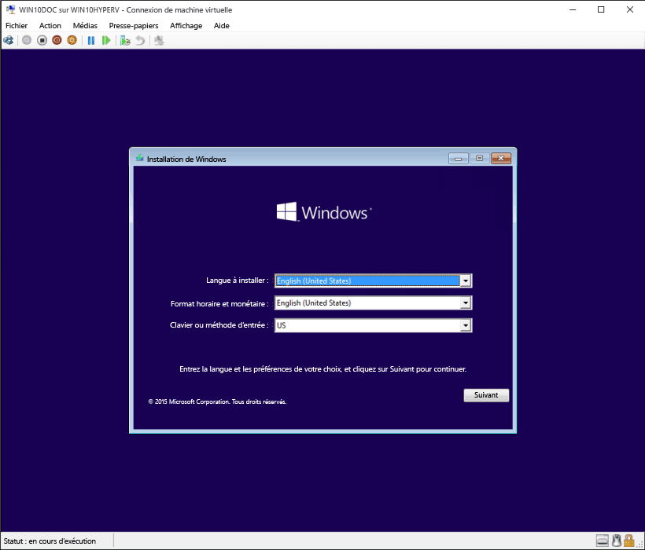

# Créer une machine virtuelle avec Hyper-V

Créer une machine virtuelle et installer son système d’exploitation.

Nous avons mis au point de nouveaux outils pour la création d’ordinateurs virtuels et les instructions ont considérablement changé au fil des trois dernières versions.

Choisissez votre système d’exploitation pour le bon jeu d’instructions:

* [Windows10FallCreatorsUpdate et versions ultérieures](quick-create-virtual-machine.md#windows-10-fall-creators-update)
* [Windows10 Creators Update](quick-create-virtual-machine.md#windows-10-creators-update)
* [Mise à jour anniversaire Windows10 et versions antérieures](quick-create-virtual-machine.md#before-windows-10-creators-update)

Commençons.

## Windows10 Fall Creators Update

Dans Fall Creators Update, Création rapide a été étendu pour inclure une bibliothèque d’ordinateurs virtuels qui peut être lancée indépendamment du Gestionnaire Hyper-V.

Pour créer un nouvel ordinateur virtuel dans Fall Creators Update:

1. Ouvrez Création rapide Hyper-V à partir du menu Démarrer.

    

1. Sélectionnez un système d’exploitation ou choisissez le vôtre un utilisant une source d’installation locale.

    

    1. Si vous souhaitez utiliser votre propre image pour créer l’ordinateur virtuel, sélectionnez **Source d’installation locale **.
    1. Sélectionnez **Change Installation Source**.
      
    1. Choisissez le fichier .iso ou .vhdx que vous souhaitez convertir en un nouvel ordinateur virtuel.
    1. Si l’image est une image Linux, désélectionnez l’option de démarrage sécurisé.
      

1. Sélectionner «Créer un ordinateur virtuel»

Et voilà!  Création rapide se charge du reste.

## Windows10 Creators Update

1. Ouvrez le gestionnaire Hyper-V à partir du menu Démarrer.

1. Dans le Gestionnaire Hyper-V, trouvez **Création rapide** sur le menu **Actions** de droite.

1. Personnalisez votre ordinateur virtuel.

    * (facultatif) Nommez la machine virtuelle.
    * Sélectionnez le support d’installation de la machine virtuelle. Vous pouvez l'installer à partir d’un fichier .iso ou .vhdx.
    Si vous installez Windows sur la machine virtuelle, vous pouvez activer le démarrage sécurisé de Windows. Sinon, laissez-le non sélectionné.
    * Configurer un réseau.
    Si vous disposez d'un commutateur virtuel existant, vous pouvez le sélectionner sur la liste déroulante du réseau. Si vous ne disposez d’aucun commutateur existant, vous verrez un bouton permettant de configurer un réseau automatique, ce qui configurera automatiquement un réseau virtuel.

1. Cliquez sur **Connecter** pour démarrer votre ordinateur virtuel. Ne vous inquiétez pas de la modification des paramètres, vous pouvez revenir en arrière et les modifier à tout moment.

    Vous pouvez être invité à appuyer sur une touche quelconque pour démarrer à partir d’un CD ou d’un DVD. Dans ce cas, appuyez sur une touche pour continuer.  Pour lui, vous effectuez l'installation depuis un CD.

Félicitations, vous avez une nouvelle machine virtuelle.  Vous êtes maintenant prêt à installer le système d’exploitation.

Votre ordinateur virtuel doit ressembler plus ou moins à ceci:

> **Remarque:** si vous n’exécutez pas une version de Windows sous licence en volume, vous devez posséder une licence distincte pour Windows qui s’exécute sur un ordinateur virtuel. Le système d’exploitation de l’ordinateur virtuel est indépendant du système d’exploitation de l’hôte.

## Avant Windows10 Creators Update

Si vous n’exécutez pas Windows10Creators Update ou une version ultérieure, suivez plutôt les instructions à l’aide de l’Assistant Nouvel ordinateur virtuel:

1. [Créer un réseau virtuel](connect-to-network.md)
1. [Créer un ordinateur virtuel](create-virtual-machine.md)
