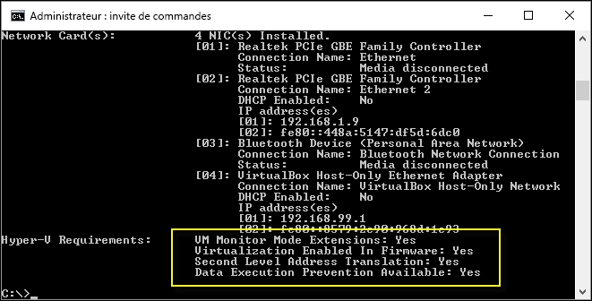

# Configuration requise pour Hyper-V sur Windows 10

Pour faire fonctionner Hyper-V sur Windows 10, votre matériel et votre système d’exploitation doivent répondre à un ensemble spécifique de spécifications. Ce document examine brièvement les configurations matérielle et logicielle requises d’Hyper-V et vous montre comment vérifier la compatibilité de votre système avec Hyper-V. Bien que ce document ne détaille pas toutes les configurations système compatibles avec Hyper-V, vous pouvez vous servir des instructions fournies ici pour vous aider à déterminer rapidement si votre système actuel peut héberger des machines virtuelles Hyper-V.

## Configuration requise pour le système d’exploitation

Le rôle Hyper-V peut être activé sur ces versions de Windows 10 :

- Windows 10 Entreprise
- Windows 10 Professionnel
- Windows 10 Éducation

Le rôle Hyper-V ne peut pas être installé sur :

- Windows 10 Famille
- Windows 10 Mobile
- Windows 10 Mobile Entreprise

> Windows 10 Famille peut être mis à niveau vers Windows 10 Professionnel. Pour cela, ouvrez **Paramètres** > **Mise à jour et sécurité** > **Activation**. Vous pouvez alors visiter le magasin et acheter la mise à niveau.

## Configuration matérielle requise

Bien que ce document ne fournisse pas la liste complète du matériel compatible avec Hyper-V, vous devez disposer des éléments suivants :

- Processeur 64 bits avec traduction d’adresse de second niveau (SLAT).
- Processeur prenant en charge les extensions de mode du moniteur de machine virtuelle (VT-c sur les processeurs Intel).
- Au minimum 4 Go de mémoire. Toutefois, étant donné que les machines virtuelles partagent la mémoire avec l’hôte Hyper-V, vous devez fournir suffisamment de mémoire pour gérer la charge de travail virtuelle attendue.

Les éléments suivants doivent être activés dans le BIOS système :
- Technologie de virtualisation (cette appellation peut varier selon le fabricant de la carte mère).
- Prévention de l’exécution des données appliquée par le matériel.

## Vérifier la compatibilité matérielle

Pour vérifier la compatibilité, ouvrez PowerShell ou une invite de commandes (cmd.exe), puis tapez **systeminfo.exe**. Vous obtenez des informations sur la compatibilité avec Hyper-V.
Si tous les éléments de la configuration requise pour Hyper-V ont la valeur **Oui**, votre système peut exécuter le rôle Hyper-V. Si l’un des éléments a la valeur **Non**, passez en revue la configuration requise figurant dans ce document et apportez des ajustements dans la mesure du possible.



Si vous exécutez **systeminfo.exe** sur un hôte Hyper-V existant, la section Configuration requise pour Hyper-V indique ce qui suit :

```
Hyper-V Requirements: A hypervisor has been detected. Features required for Hyper-V are not be displayed.
```

## Étape suivante : installer Hyper-V

[Étape suivante : installer Hyper-V](walkthrough_install.md)


