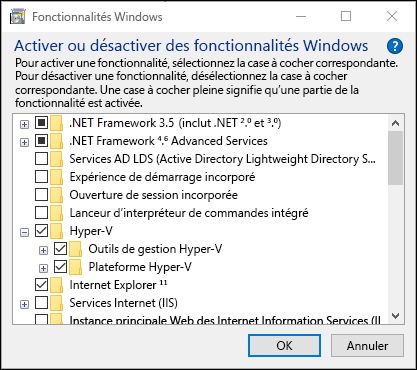
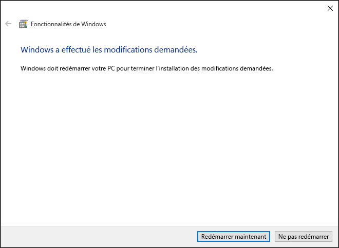
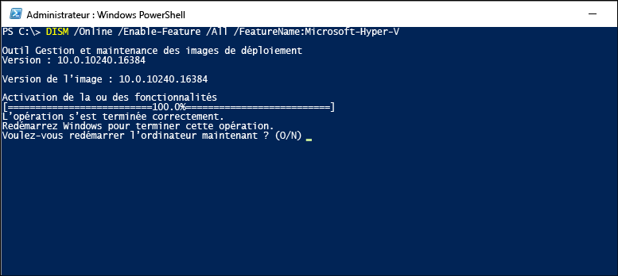

# Installer Hyper-V sur Windows 10

Avant de pouvoir créer des machines virtuelles sur Windows 10, vous devez activer le rôle Hyper-V. Pour cela, vous pouvez utiliser le Panneau de configuration Windows 10, PowerShell ou l’outil de gestion et de maintenance des images de déploiement (DISM). Ce document présente chacune de ces options.

> Avant d’activer Hyper-V, vérifiez que votre système est compatible. Pour plus d’informations, consultez [Configuration système requise pour Hyper-V dans Windows 10](https://msdn.microsoft.com/virtualization/hyperv_on_windows/quick_start/walkthrough_compatibility).

## Installer manuellement le rôle Hyper-V

1. Cliquez avec le bouton droit sur le bouton Windows et sélectionnez Programmes et fonctionnalités.

2. Sélectionnez **Activer ou désactiver des fonctionnalités Windows**.

3. Sélectionnez **Hyper-V**, puis cliquez sur **OK**.



Une fois l’installation terminée, vous êtes invité à redémarrer votre ordinateur.



## Installer Hyper-V avec PowerShell

1. Ouvrez une console PowerShell en tant qu’administrateur.

2. Exécutez la commande suivante :

```powershell
Enable-WindowsOptionalFeature -Online -FeatureName Microsoft-Hyper-V -All
```
Une fois l’installation terminée, vous devez redémarrer votre ordinateur.

## Installer Hyper-V avec DISM

À l’aide de l’outil de gestion et de maintenance des images de déploiement (DISM), vous pouvez traiter des images Windows et préparer des environnements de préinstallation Windows. Vous pouvez également utiliser DISM pour activer des fonctionnalités Windows pendant que le système d’exploitation est en cours d’exécution. Pour plus d’informations, consultez [Informations techniques de référence sur DISM](https://technet.microsoft.com/en-us/library/hh824821.aspx).

Pour activer le rôle Hyper-V à l’aide de DISM :

1. Ouvrez une session PowerShell ou CMD en tant qu’administrateur.

2. Tapez la commande suivante :

```powershell
DISM /Online /Enable-Feature /All /FeatureName:Microsoft-Hyper-V
```



## Étape suivante : créer un commutateur virtuel

[Créer un commutateur virtuel](walkthrough_virtual_switch.md)


<!--HONumber=Feb16_HO4-->


