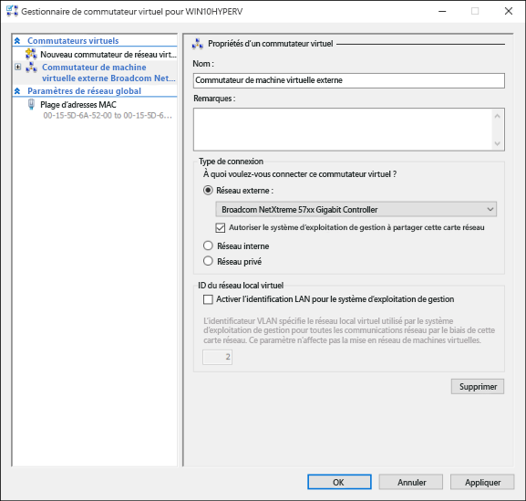

# Créer un commutateur virtuel 

Avant de créer une machine virtuelle dans Hyper-V, vous pouvez fournir à cette machine virtuelle un moyen de se connecter à un réseau physique. Pour assurer la connectivité réseau, Hyper-V inclut une technologie logicielle de mise en réseau qui permet à la carte réseau d’une machine virtuelle de se connecter à un commutateur virtuel. Pour chaque commutateur virtuel créé dans Hyper-V, vous pouvez sélectionner l’un des trois types de connexion suivants :

- **Réseau externe** : le commutateur virtuel est connecté à une carte réseau physique qui assure la connectivité entre le réseau physique, l’hôte Hyper-V et la machine virtuelle. Dans cette configuration, vous pouvez également activer ou désactiver la capacité des hôtes à communiquer par le biais de la carte réseau connectée physiquement. Cela peut être utile pour isoler le trafic d’une machine virtuelle à une carte réseau physique donnée.

- **Réseau interne** : le commutateur virtuel n’est pas connecté à une carte réseau physique. Cependant, il existe une connectivité réseau entre l’ordinateur hôte Hyper-V et toutes les machines virtuelles connectées à ce commutateur.

- **Réseau privé** : le commutateur virtuel n’est pas connecté à une carte réseau physique, et la connectivité réseau n’est pas assurée entre l’hôte Hyper-V et les machines virtuelles connectées au commutateur.

## Créer manuellement un commutateur virtuel

Cet exercice vous montre comment créer un commutateur virtuel externe à l’aide du Gestionnaire Hyper-V. À l’issue de celui-ci, votre hôte Hyper-V contiendra un commutateur virtuel que vous pourrez utiliser pour connecter des machines virtuelles à un réseau physique. 

1. Ouvrez le Gestionnaire Hyper-V.

2. Cliquez avec le bouton droit sur le nom de l’hôte Hyper-V, puis sélectionnez **Gestionnaire de commutateur virtuel...**

3. Sous « Commutateurs virtuels », sélectionnez **Nouveau commutateur réseau virtuel**.

4. Sous « Quel type de commutateur virtuel voulez-vous créer ? », sélectionnez **Externe**.

5. Sélectionnez le bouton **Créer un commutateur virtuel**.

6. Sous « Propriétés du commutateur virtuel », attribuez un nom au nouveau commutateur, par exemple **Commutateur de machine virtuelle externe**.

7. Sous « Type de connexion », vérifiez que l’option **Réseau externe** est sélectionnée.

8. Sélectionnez la carte réseau physique à associer au nouveau commutateur virtuel. Il s’agit de la carte réseau qui est physiquement connectée au réseau.  

    

9. Sélectionnez **Appliquer** pour créer le commutateur virtuel. À ce stade, il est probable que le message ci-dessous s’affiche. Cliquez sur **Oui** pour continuer.

      

10. Sélectionnez **OK** pour fermer la fenêtre Gestionnaire de commutateur virtuel.

## Créer un commutateur virtuel avec PowerShell

Pour créer un commutateur virtuel avec une connexion externe à l’aide de PowerShell, effectuez les étapes suivantes. 

1. Pour obtenir la liste des cartes réseau connectées au système Windows 10, utilisez la commande **Get-NetAdapter**.

    ```powershell
    PS C:\> Get-NetAdapter

    Name                      InterfaceDescription                    ifIndex Status       MacAddress             LinkSpeed
    ----                      --------------------                    ------- ------       ----------             ---------
    Ethernet 2                Broadcom NetXtreme 57xx Gigabit Cont...       5 Up           BC-30-5B-A8-C1-7F         1 Gbps
    Ethernet                  Intel(R) PRO/100 M Desktop Adapter            3 Up           00-0E-0C-A8-DC-31        10 Mbps  
    ```

2. Sélectionnez la carte réseau à utiliser avec le commutateur Hyper-V, puis placez une instance dans une variable nommée **$net**.

    ```
    $net = Get-NetAdapter -Name 'Ethernet'
    ```

3. Exécutez la commande suivante pour créer le commutateur virtuel Hyper-V.

    ```
    New-VMSwitch -Name "External VM Switch" -AllowManagementOS $True -NetAdapterName $net.Name
    ```

## Commutateurs virtuels et ordinateurs portables

Si vous exécutez Windows 10 Hyper-V sur un ordinateur portable, vous pouvez créer un commutateur virtuel pour la carte Ethernet et pour la carte réseau sans fil. Dans cette configuration, vous pouvez faire basculer vos machines virtuelles entre ces commutateurs en fonction de la façon dont l’ordinateur portable est connecté au réseau. Les machines virtuelles ne basculent pas automatiquement entre une connexion filaire et une connexion sans fil.

## Étape suivante : créer une machine virtuelle
[Créer une machine virtuelle Windows](walkthrough_create_vm.md)


<!--HONumber=Jun16_HO4-->


