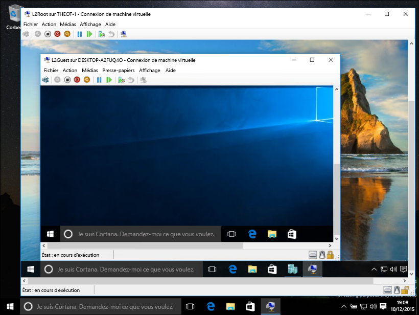
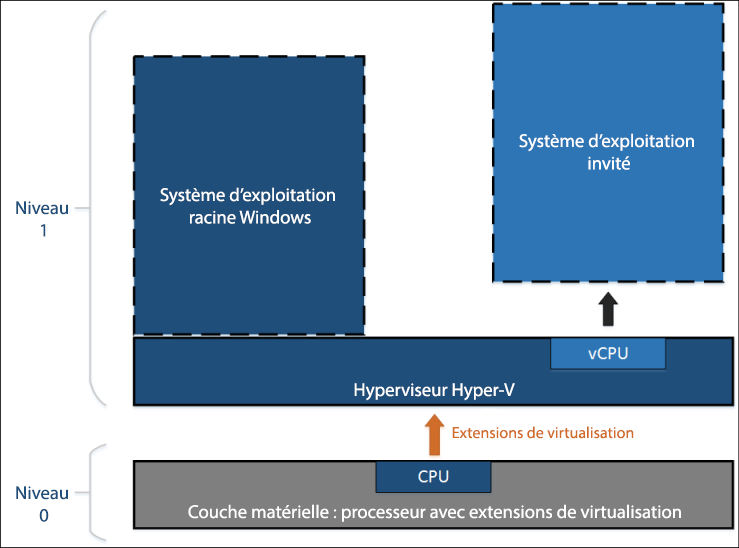
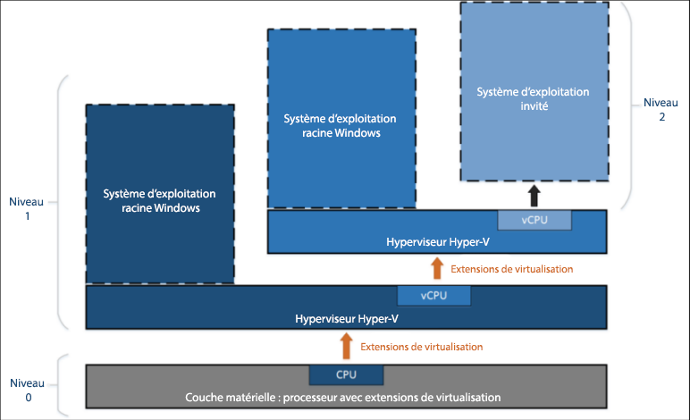

# Virtualisation imbriquée

> **Remarque :** cette fonctionnalité préliminaire anticipée est uniquement disponible pour les Windows Insiders qui exécutent la Build 10565 ou version ultérieure. Elle n’inclut aucune garantie de performances ou de stabilité.

La virtualisation imbriquée exécute la virtualisation dans un environnement virtualisé. En d’autres termes, l’imbrication vous permet d’exécuter le rôle serveur Hyper-V au sein d’une machine virtuelle.



Hyper-V s’appuie sur la prise en charge de la virtualisation matérielle (par ex., Intel VT-x et AMD-V) pour exécuter des machines virtuelles. En règle générale, une fois qu’Hyper-V est installé, l’hyperviseur masque cette fonction sur les machines virtuelles invitées. Cela empêche les machines virtuelles invitées d’exécuter le rôle serveur Hyper-V sur d’autres hyperviseurs.

La virtualisation imbriquée expose les composants de prise en charge de la virtualisation matérielle à la machine virtuelle invitée.

Le diagramme ci-dessous illustre Hyper-V sans imbrication. L’hyperviseur Hyper-V prend le contrôle total des extensions de virtualisation matérielle (flèche orange) et ne les expose pas au système d’exploitation invité.



En revanche, le diagramme ci-dessous illustre Hyper-V avec imbrication. Dans ce cas, Hyper-V expose les extensions de virtualisation matérielle à ses machines virtuelles. Quand l’imbrication est activée, une machine virtuelle invitée peut installer son propre hyperviseur et exécuter ses propres machines virtuelles invitées.



## Configuration requise de la virtualisation imbriquée

Avant d’activer la virtualisation imbriquée, notez qu’il s’agit d’une version préliminaire. N’utilisez pas l’imbrication dans des environnements de production.

Configuration requise :
* 4 Go de RAM disponible au minimum. La virtualisation imbriquée nécessite une quantité de mémoire importante.
* Les deux hyperviseurs doivent être la dernière build de Windows Insider (10565 ou supérieure). Les autres hyperviseurs ne fonctionnent pas.
* Cette fonctionnalité est actuellement exclusivement Intel. Intel VT-x est nécessaire.

## Activer la virtualisation imbriquée

1. Créez une machine virtuelle exécutant la même build que celle de votre hôte. [Instructions ici](../quick_start/walkthrough_create_vm.md).

2. Exécutez [ce script](https://github.com/Microsoft/Virtualization-Documentation/blob/master/hyperv-tools/Nested/Enable-NestedVm.ps1) en tant qu’administrateur sur l’hôte Hyper-V.

    Dans cette version préliminaire, l’imbrication inclut quelques exigences de configuration. Pour faciliter les choses, [ce script PowerShell](https://github.com/Microsoft/Virtualization-Documentation/blob/master/hyperv-tools/Nested/Enable-NestedVm.ps1) vérifie votre configuration, remplace tout ce qui est incorrect, puis active la virtualisation imbriquée pour la machine virtuelle spécifiée.

  ``` PowerShell
  Invoke-WebRequest https://raw.githubusercontent.com/Microsoft/Virtualization-Documentation/master/hyperv-tools/Nested/Enable-NestedVm.ps1 -OutFile ~/Enable-NestedVm.ps1 
  ~/Enable-NestedVm.ps1 -VmName "DemoVM"
  ```

3. Installez Hyper-V dans la machine virtuelle.

  ``` PowerShell
  Invoke-Command -VMName "DemoVM" -ScriptBlock { Enable-WindowsOptionalFeature -FeatureName Microsoft-Hyper-V -Online; Restart-Computer }
  ```

4. Créez des machines virtuelles imbriquées.

## Problèmes connus

Voici une liste des problèmes connus :
* Les hôtes sur lesquels la fonctionnalité Device Guard est activée ne peuvent pas exposer les extensions de virtualisation aux invités.

* Les hôtes sur lesquels la sécurité basée sur la virtualisation est activée ne peuvent pas exposer les extensions de virtualisation aux invités. Vous devez d’abord désactiver la sécurité basée sur la virtualisation pour pouvoir afficher un aperçu de la virtualisation imbriquée.

* Une fois la virtualisation imbriquée activée sur une machine virtuelle, les fonctionnalités suivantes ne sont plus compatibles avec cette machine virtuelle.  
    Ces actions échouent ou empêchent la machine virtuelle de démarrer si elle héberge d’autres machines virtuelles :
    * La mémoire dynamique doit être désactivée. Sinon la machine virtuelle ne peut pas démarrer.
    * Le redimensionnement de la mémoire d’exécution échoue.
    * L’application de points de contrôle à une machine virtuelle en cours d’exécution échoue.
    * La migration dynamique échoue. En d’autres termes, une machine virtuelle qui héberge d’autres machines virtuelles ne peut pas être migrée dynamiquement.
    * La sauvegarde/restauration échoue.

    > **Remarque :** ces fonctionnalités fonctionnent toujours dans la machine virtuelle invitée la « plus interne ». Les restrictions s’appliquent uniquement à la première couche de machines virtuelles.

* Une fois la virtualisation imbriquée activée, l’usurpation MAC doit être activée sur la machine virtuelle pour que la mise en réseau fonctionne sur les invités les « plus internes ».

## FAQ et résolution des problèmes

### Ma machine virtuelle ne démarre pas, que dois-je faire ?

1. Assurez-vous que la mémoire dynamique est désactivée.
2. Exécutez ce script PowerShell sur votre ordinateur hôte à partir d’une invite de commandes avec élévation de privilèges.

    Ce script indique si votre hôte et les machines virtuelles sont configurés correctement pour l’imbrication.

  ``` PowerShell
  Invoke-WebRequest https://raw.githubusercontent.com/Microsoft/Virtualization-Documentation/master/hyperv-tools/Nested/Get-NestedVirtStatus.ps1 -OutFile ~/Get-NestedVirtStatus.ps1 
  ~/Get-NestedVirtStatus.ps1
  ```

### La connexion à une machine virtuelle n’est pas rétablie.

Si vous utilisez un mot de passe vide, il s’agit d’un problème connu. Modifiez votre mot de passe pour résoudre le problème.

### Mon problème n’est pas indiqué ici.

Votre problème n’est pas indiqué ? Vous avez des commentaires ? Contactez-nous.

Indiquez-les dans l’application Commentaires sur Windows, les [forums sur la virtualisation](https://social.technet.microsoft.com/Forums/windowsserver/En-us/home?forum=winserverhyperv) ou sur [GitHub](https://github.com/Microsoft/Virtualization-Documentation).


