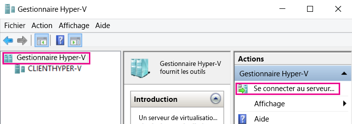
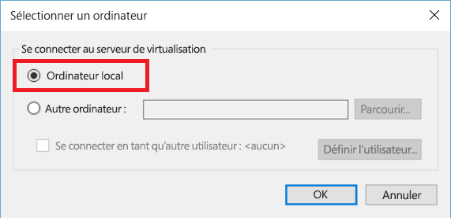
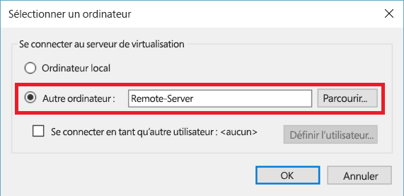

# Gérer des hôtes Hyper-V distants avec le Gestionnaire Hyper-V

Le Gestionnaire Hyper-V est un outil intégré à Windows pour diagnostiquer et gérer votre hôte Hyper-V local et un petit nombre d’hôtes distants.  Cet article décrit les étapes de configuration pour se connecter aux hôtes Hyper-V à l’aide du Gestionnaire Hyper-V dans toutes les configurations prises en charge.

> Le Gestionnaire Hyper-V est disponible dans **Programmes et fonctionnalités** en tant qu’**Outils de gestion Hyper-V** sur [n’importe quel système d’exploitation Windows incluant Hyper-V](../quick_start/walkthrough_compatibility.md#OperatingSystemRequirements).  La plateforme Hyper-V n’a pas besoin d’être activée pour gérer les hôtes distants.

Pour vous connecter à un hôte Hyper-V dans le Gestionnaire Hyper-V, assurez-vous que **Gestionnaire Hyper-V** est sélectionné dans le volet gauche, puis sélectionnez **Se connecter au serveur...** dans le volet droit.



## Combinaisons d’hôtes Hyper-V prises en charge par le Gestionnaire Hyper-V
Le Gestionnaire Hyper-V dans Windows 10 vous permet de gérer les hôtes Hyper-V suivants :
* Windows 10
* Windows 8.1
* Windows 8
* Windows Server 2016 : toutes les éditions et options d’installation, y compris Nano Server et la version correspondante du serveur Hyper-V
* Windows Server 2012 R2 : toutes les éditions et options d’installation, et la version correspondante du serveur Hyper-V
* Windows Server 2012 : toutes les éditions et options d’installation, et la version correspondante du serveur Hyper-V

Le Gestionnaire Hyper-V dans Windows 8.1 et Windows Server 2012 R2 vous permet de gérer les hôtes suivants :
* Windows 8.1
* Windows 8
* Windows Server 2012 R2 : toutes les éditions et options d’installation, et la version correspondante du serveur Hyper-V
* Windows Server 2012 : toutes les éditions et options d’installation, et la version correspondante du serveur Hyper-V

Le Gestionnaire Hyper-V dans Windows 8 et Windows Server 2012 vous permet de gérer les hôtes suivants :
* Windows 8
* Windows Server 2012 : toutes les éditions et options d’installation, et la version correspondante du serveur Hyper-V

Le Gestionnaire Hyper-V dans Windows 7 et Windows Server 2008 R2 vous permet de gérer les hôtes suivants :
* Windows Server 2008 R2 : toutes les éditions et options d’installation, et la version correspondante du serveur Hyper-V

Le Gestionnaire Hyper-V dans Windows Vista et Windows Server 2008 vous permet de gérer les hôtes suivants :
* Windows Server 2008 : toutes les éditions et options d’installation, et la version correspondante du serveur Hyper-V

> **Remarque :** La fonctionnalité du Gestionnaire Hyper-V correspond à la fonctionnalité disponible pour la version que vous gérez. En d’autres termes, si vous gérez un hôte Windows Server 2012 distant à partir de Windows Server 2012 R2, les nouvelles fonctionnalités du Gestionnaire Hyper-V de Windows Server 2012 R2 ne sont pas disponibles.

## Gérer l’hôte local ##
Pour ajouter l’hôte local au Gestionnaire Hyper-V en tant qu’hôte Hyper-V, dans la boîte de dialogue **Sélectionner un ordinateur**, sélectionnez **Ordinateur local**.



Si une connexion ne peut pas être établie :
*  Assurez-vous que le rôle de la plateforme Hyper-V est activé.  
  Pour savoir si Hyper-V est pris en charge, voir la [section du guide pas à pas relative à la vérification de la compatibilité](../quick_start/walkthrough_compatibility.md).
*  Vérifiez que votre compte d’utilisateur fait partie du groupe Administrateurs Hyper-V.


## Gérer un autre hôte Hyper-V dans le même domaine ##

Pour ajouter un hôte Hyper-V distant au Gestionnaire Hyper-V, dans la boîte de dialogue **Sélectionner un ordinateur**, sélectionnez **Autre ordinateur**, puis entrez le nom d’hôte, le NetBIOS ou le nom de domaine complet de l’hôte distant dans le champ de texte.



Pour gérer les hôtes Hyper-V distants, la gestion à distance doit être activée sur l’ordinateur local et l’hôte distant.

Pour cela, accédez à `Server Manager -> Remote management` ou exécutez la commande PowerShell suivante en tant qu’administrateur : 

``` PowerShell
Enable-PSRemoting
```

Si votre compte d’utilisateur actuel correspond à un compte Administrateur Hyper-V sur l’hôte distant, continuez et appuyez sur **OK** pour établir la connexion.  

> Il s’agit de la seule façon de gérer un hôte distant dans le Gestionnaire Hyper-V dans Windows 8 ou Windows 8.1.


Windows 10 a largement étendu les combinaisons possibles des types de connexions à distance.  
Vous pouvez désormais vous connecter à un hôte distant Windows 10 ou version ultérieure à l’aide du nom d’hôte ou de l’adresse IP.  Le Gestionnaire Hyper-V prend aussi désormais en charge la possibilité d’entrer d’autres informations d’identification de l’utilisateur.  


### Se connecter à l’hôte distant en tant qu’autre utilisateur
> Cela est possible uniquement quand vous vous connectez à un hôte distant Windows 10 ou Windows Server 2016 Technical Preview 3 ou version ultérieure

Dans Windows 10, si vous n’avez pas ouvert de session avec le compte d’utilisateur approprié pour l’hôte distant, vous pouvez vous connecter en tant qu’autre utilisateur avec d’autres informations d’identification.

Pour spécifier les informations d’identification de l’hôte Hyper-V distant, sélectionnez **Se connecter en tant qu’autre utilisateur : ** dans la boîte de dialogue **Sélectionner un ordinateur**, puis sélectionnez **Définir l’utilisateur...**.


### Se connecter à l’hôte distant à l’aide de l’adresse IP
> Cela est possible uniquement quand vous vous connectez à un hôte distant Windows 10 ou Windows Server 2016 Technical Preview 3 ou version ultérieure

Il est parfois plus facile de se connecter à l’aide de l’adresse IP que du nom d’hôte. Windows 10 vous permet de le faire.

Pour vous connecter à l’aide de l’adresse IP, entrez l’adresse IP dans le champ de texte **Autre ordinateur**.


## Gérer un hôte Hyper-V en dehors de votre domaine (ou sans domaine) ##
> Cela est possible uniquement quand vous vous connectez à un hôte distant Windows 10 ou Windows Server 2016 Technical Preview 3 ou version ultérieure

Sur l’hôte Hyper-V à gérer, exécutez les commandes suivantes en tant qu’administrateur :

1.  [Enable-PSRemoting](https://technet.microsoft.com/en-us/library/hh849694.aspx)
  * [Enable-PSRemoting](https://technet.microsoft.com/en-us/library/hh849694.aspx) crée les règles de pare-feu nécessaires pour les zones *privées* du réseau. Vous devez activer les règles pour CredSSP et WinRM pour autoriser l’accès sur les zones publiques.
2.  [Enable-WSManCredSSP](https://technet.microsoft.com/en-us/library/hh849872.aspx) -Role server

Sur le PC de gestion, exécutez la commande suivante en tant qu’administrateur :

1. Set-Item WSMan:\localhost\Client\TrustedHosts -Value "fqdn-of-hyper-v-host"
2. [Enable-WSManCredSSP](https://technet.microsoft.com/en-us/library/hh849872.aspx) -Role client -DelegateComputer "fqdn-of-hyper-v-host"
3. En outre, vous devrez peut-être configurer la stratégie de groupe suivante : ** Configuration de l’ordinateur | Modèles d’administration | Système | Délégation d’informations d’identification | Autoriser la délégation des nouvelles informations d’identification avec l’authentification du serveur NTLM uniquement **
    * Cliquez sur **Activer** et ajoutez *wsman/fqdn-of-hyper-v-host*


<!--HONumber=Oct16_HO4-->


