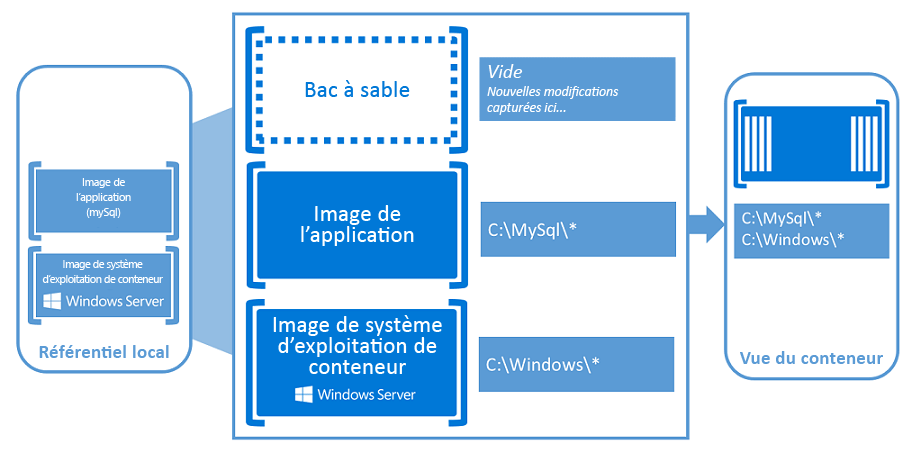

# Conteneurs Windows

À l’ère du mobile et du cloud, les applications sont vecteurs d’innovation. Les conteneurs, et l’écosystème qui se développe autour, encouragent les développeurs de logiciels à créer la prochaine génération d’expériences d’applications.

Découvrez ici une petite vidéo de présentation : [Conteneurs Windows : développement d’applications modernes avec un contrôle de niveau professionnel](https://youtu.be/Ryx3o0rD5lY).

## Présentation des conteneurs

Ils constituent un environnement d’exploitation isolé, mobile et contrôlé par les ressources.

En fait, un conteneur est un endroit isolé dans lequel une application peut s’exécuter sans affecter le reste du système et sans que le système n’affecte l’application. Les conteneurs sont la prochaine étape de la virtualisation.

Si vous étiez à l’intérieur d’un conteneur, vous vous sentiriez comme dans une machine virtuelle ou un ordinateur physique nouvellement installé. Et, pour [Docker](https://www.docker.com/), un conteneur Windows Server peut être géré de la même façon que tout autre conteneur.

## Conteneurs Windows

Les conteneurs Windows incluent deux types de conteneurs différents, ou runtimes.

**Conteneurs Windows Server** : ils assurent l’isolation des applications via une technologie d’isolation des processus et des espaces de noms. Un conteneur Windows Server partage un noyau avec l’hôte de conteneur et tous les conteneurs exécutés sur l’hôte.

**Conteneurs Hyper-V** : ils développent l’isolation fournie par les conteneurs Windows Server en exécutant chaque conteneur dans une machine virtuelle hautement optimisée. Dans cette configuration, le noyau de l’hôte de conteneur n’est pas partagé avec les conteneurs Hyper-V.

## Notions de base sur les conteneurs

Quand vous commencez à utiliser des conteneurs, vous remarquez de nombreuses similitudes entre un conteneur et une machine virtuelle. Un conteneur exécute un système d’exploitation, a un système de fichiers et est accessible via un réseau comme s’il s’agissait d’un système d’ordinateur physique ou virtuel. Ceci dit, la technologie et les concepts derrière les conteneurs sont très différents de ceux des machines virtuelles.

[Ce billet de blog](http://azure.microsoft.com/blog/2015/08/17/containers-docker-windows-and-trends/) de Mark Russinovich décrit bien les conteneurs.

Les concepts clés suivants peuvent s’avérer utiles quand vous commencez à créer des conteneurs Windows et à les utiliser.

**Hôte de conteneur :** système d’ordinateur physique ou virtuel configuré avec la fonctionnalité de conteneur Windows. L’hôte de conteneur exécute un ou plusieurs conteneurs Windows.

**Image de conteneur :** quand des modifications sont apportées au système de fichiers ou au Registre d’un conteneur, par exemple lors de l’installation d’un logiciel, elles sont capturées dans un bac à sable (sandbox). Dans de nombreux cas, vous pouvez capturer cet état pour que des conteneurs qui héritent de ces modifications puissent être créés. C’est ce qui constitue une image : une fois le conteneur arrêté, vous pouvez ignorer ce bac à sable (sandbox) ou vous pouvez le convertir en une nouvelle image de conteneur. Par exemple, imaginons que vous avez déployé un conteneur à partir de l’image de système d’exploitation Windows Server Core. Vous installez ensuite MySQL dans ce conteneur. La création d’une image à partir de ce conteneur fait office de version pouvant être déployée du conteneur. Cette image contient uniquement les modifications apportées (MySQL), mais fonctionne toutefois comme une couche sur l’image de système d’exploitation de conteneur.

**Bac à sable (sandbox) :** une fois un conteneur démarré, toutes les actions d’écriture, telles que les modifications du système de fichiers, les modifications du Registre ou les installations de logiciels, sont capturées dans cette couche.

**Image de système d’exploitation de conteneur :** les conteneurs sont déployés à partir d’images. L’image de système d’exploitation de conteneur est la première couche d’un nombre éventuellement important de couches d’images qui constituent un conteneur. Cette image fournit l’environnement du système d’exploitation. Une image de système d’exploitation de conteneur est immuable et ne peut pas être modifiée.

**Référentiel de conteneurs :** chaque fois qu’une image de conteneur est créée, cette image et ses dépendances sont stockées dans un référentiel local. Ces images peuvent être réutilisées plusieurs fois sur l’hôte de conteneur. Les images de conteneur peuvent également être stockées dans un registre public ou privé, tel que Docker Hub, afin de pouvoir être utilisées sur plusieurs hôtes de conteneurs différents.

**Technologie de gestion des conteneurs :** les conteneurs Windows peuvent être gérés à l’aide de PowerShell et Docker. Avec l’un ou l’autre de ces outils ,vous pouvez créer des conteneurs et des images de conteneur, et gérer le cycle de vie des conteneurs.

## Conteneurs pour les développeurs

Qu’il s’agisse de l’ordinateur de bureau d’un développeur, d’un ordinateur de test ou d’un groupe de machines de production, il est possible de créer une image Docker qui sera déployée de façon identique dans tous les environnements en quelques secondes. De là est né un solide écosystème de plus en plus important d’applications empaquetées dans des conteneurs Docker avec Docker Hub, registre public d’applications en conteneur géré par Docker qui publie actuellement plus de 180 000 applications dans le référentiel de la communauté publique.

Quand vous mettez une application en conteneur, seule l’application et les composants nécessaires pour exécuter l’application sont combinés en une « image ». Les conteneurs sont ensuite créés à partir de cette image si vous en avez besoin. Vous pouvez également utiliser une image comme référence pour créer une autre image, ce qui accélère encore davantage la création d’images. Plusieurs conteneurs peuvent partager la même image, ce qui signifie que les conteneurs démarrent très rapidement et utilisent moins de ressources. Par exemple, vous pouvez utiliser des conteneurs pour faire tourner des composants d’application légers et mobiles (ou « micro-services ») pour les applications distribuées et adapter rapidement chaque service séparément.

Étant donné que le conteneur dispose de tout ce dont il a besoin pour exécuter votre application, il est très mobile et peut être exécuté sur n’importe quel ordinateur qui exécute Windows Server 2016. Vous pouvez créer et tester localement des conteneurs, puis déployer cette même image de conteneur sur le cloud privé, le cloud public ou le fournisseur de services de votre société. De nature souple, les conteneurs prennent en charge les modèles de développement d’applications modernes dans des environnements cloud, virtualisés et à grande échelle.

Les conteneurs permettent aux développeurs de créer une application dans n’importe quel langage. Ces applications sont entièrement mobiles et peuvent être exécutées n’importe où (ordinateur portable, ordinateur de bureau, serveur, cloud privé, cloud public ou fournisseur de services) sans aucune modification du code.

Les conteneurs aident les développeurs à générer et livrer des applications de meilleure qualité, plus rapidement.

## Conteneurs pour les professionnels de l’informatique

Les professionnels de l’informatique peuvent utiliser des conteneurs pour fournir des environnements standardisés à leurs équipes de développement, d’assurance qualité et de production. Ils n’ont plus à se soucier des procédures d’installation et de configuration complexes. En utilisant des conteneurs, les administrateurs système font abstraction des différences dans les installations du système d’exploitation et l’infrastructure sous-jacente.

Les conteneurs aident les administrateurs à créer une infrastructure qui est plus simple à mettre à jour et à gérer.

## Vidéo de présentation

<iframe 
src="https://channel9.msdn.com/Blogs/containers/Containers-101-with-Microsoft-and-Docker/player" width="800" height="450" allowFullScreen="true" frameBorder="0" scrolling="no"></iframe>

## Essayer les conteneurs Windows Server

[Prise en main des conteneurs Windows dans Windows Azure](../quick_start/azure_setup.md)  
[Prise en main des conteneurs Windows localement](../quick_start/container_setup.md)

