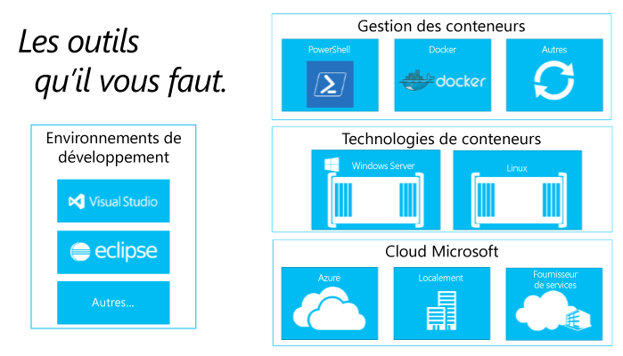

# Création d’un écosystème de conteneurs

Pour comprendre pourquoi la création d’un écosystème de conteneurs est si importante, parlons tout d’abord de Docker.

## Appel de Docker

Le concept de conteneurs (isolation des espaces de noms et gouvernance des ressources) est connu depuis longtemps et remonte aux jails BSD, aux zones Solaris et au mécanisme chroot (change root) UNIX de base.   La contribution de Docker a consisté à fournir un ensemble d’outils communs, un modèle de package et un mécanisme de déploiement.  En procédant ainsi, Docker a considérablement simplifié la mise en conteneur et la distribution des applications.  Ces applications peuvent ensuite être exécutées n’importe où sur tout hôte Linux, une fonctionnalité que nous fournissons également sur Windows.

Cette technologie très répandue simplifie non seulement la gestion en offrant les mêmes commandes d’administration par rapport à n’importe quel hôte, mais crée également une opportunité unique pour les opérations de développement transparentes.

Depuis le bureau d’un développeur jusqu’à un ordinateur de test et un ensemble de machines de production, il est possible de créer une image Docker qui sera déployée de façon identique dans tous les environnements en quelques secondes. Cette histoire a généré un écosystème croissant et à grande échelle d’applications empaquetées dans des conteneurs Docker, avec Docker Hub, le registre public des applications en conteneur géré par Docker.

Docker pose des fondements solides pour le développement.

Parlons maintenant de cet écosystème d’applications et de la façon dont vous pouvez vous baser sur les concepts de Docker pour créer un workflow de développement et de déploiement adapté à vos besoins.

## Composants d’un écosystème de conteneurs

Les conteneurs Windows sont un composant clé d’un important écosystème de conteneurs. Nous travaillons dans toute l’industrie pour offrir les choix des développeurs à chaque niveau de la pile de solution.

L’écosystème de conteneurs fournit des méthodes pour gérer des conteneurs, partager des conteneurs et développer des applications qui s’exécutent dans des conteneurs.

Microsoft souhaite encourager la productivité et les choix des développeurs à mesure qu’ils génèrent ces applications de nouvelle génération.  Notre objectif est d’alimenter la productivité des développeurs, ce qui signifie que les applications doivent pouvoir cibler n’importe quel cloud Microsoft sans avoir à modifier, réécrire ni reconfigurer le code.

Microsoft s’engage à se montrer ouvert et soucieux des écosystèmes.  Nous supportons de façon active l’union de plusieurs écosystèmes de développeurs dignes d’intérêt, tels que Windows et Linux, pour stimuler l’innovation.

Dans les prochains mois, nous vous fournirons des informations supplémentaires sur d’autres partenaires dans cet écosystème en expansion.

<!--HONumber=May16_HO3-->

