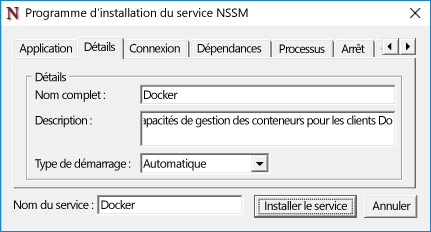
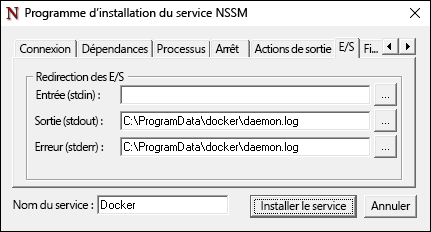

# Docker et Windows

**Il s’agit d’un contenu préliminaire qui peut faire l’objet de modifications.** 

Le moteur Docker n’est pas inclus avec Windows et doit être installé et configuré individuellement. Les étapes utilisées pour exécuter le moteur Docker sur Windows sont différentes de celles utilisées pour son exécution sur Linux. Ce document vous guide tout au long de l’installation et de la configuration du moteur Docker sur Windows Server 2016, Nano Server et le client Windows. Notez également que l’interface de ligne de commande et le moteur Docker ont été récemment séparés en deux fichiers. Ce document inclut des instructions pour les deux installations.

Pour plus d’informations sur Docker et l’ensemble d’outils Docker, visitez [Docker.com](https://www.docker.com/). 

> La fonctionnalité de conteneur Windows doit être activée avant que Docker ne permette de créer et gérer des conteneurs Windows. Pour obtenir des instructions sur l’activation de cette fonctionnalité, voir le [Guide de déploiement de l’hôte de conteneur](./docker_windows.md).

## Windows Server 2016

### Installer le démon Docker <!--1-->

Téléchargez docker.exe à partir de `https://aka.ms/tp5/dockerd`, puis placez-le dans le répertoire System32 sur l’hôte de conteneur.

```none
wget https://aka.ms/tp5/dockerd -OutFile $env:SystemRoot\system32\dockerd.exe
```

Créez un répertoire nommé `c:\programdata\docker`. Dans ce répertoire, créez un fichier nommé `runDockerDaemon.cmd`.

```none
New-Item -ItemType File -Path C:\ProgramData\Docker\runDockerDaemon.cmd -Force
```

Copiez le texte suivant dans le fichier `runDockerDaemon.cmd`.

```none
@echo off
set certs=%ProgramData%\docker\certs.d

if exist %ProgramData%\docker (goto :run)
mkdir %ProgramData%\docker

:run
if exist %certs%\server-cert.pem (if exist %ProgramData%\docker\tag.txt (goto :secure))

if not exist %systemroot%\system32\dockerd.exe (goto :legacy)

dockerd -H npipe:// 
goto :eof

:legacy
docker daemon -H npipe:// 
goto :eof

:secure
if not exist %systemroot%\system32\dockerd.exe (goto :legacysecure)
dockerd -H npipe:// -H 0.0.0.0:2376 --tlsverify --tlscacert=%certs%\ca.pem --tlscert=%certs%\server-cert.pem --tlskey=%certs%\server-key.pem
goto :eof

:legacysecure
docker daemon -H npipe:// -H 0.0.0.0:2376 --tlsverify --tlscacert=%certs%\ca.pem --tlscert=%certs%\server-cert.pem --tlskey=%certs%\server-key.pem
```
Téléchargez nssm.exe à partir de [https://nssm.cc/release/nssm-2.24.zip](https://nssm.cc/release/nssm-2.24.zip).

```none
wget https://nssm.cc/release/nssm-2.24.zip -OutFile $env:ALLUSERSPROFILE\nssm.zip
```

Extrayez le package compressé.

```none
Expand-Archive -Path $env:ALLUSERSPROFILE\nssm.zip $env:ALLUSERSPROFILE
```

Copiez `nssm-2.24\win64\nssm.exe` dans le répertoire `c:\windows\system32`.

```none
Copy-Item $env:ALLUSERSPROFILE\nssm-2.24\win64\nssm.exe $env:SystemRoot\system32
```
Exécutez `nssm install` pour configurer le service Docker.

```none
start-process nssm install
```

Entrez les données suivantes dans les champs correspondants dans le programme d’installation du service NSSM.

Onglet Application :

**Chemin d’accès :** C:\Windows\System32\cmd.exe

**Répertoire de démarrage :** C:\Windows\System32

**Arguments :** /s /c C:\ProgramData\docker\runDockerDaemon.cmd < nul

**Nom du service :** Docker


Onglet Détails :

**Nom complet :** Docker

**Description :** le démon Docker fournit des fonctionnalités de gestion de conteneurs pour les clients Docker.



Onglet E/S :

**Sortie (stdout) :** C:\ProgramData\docker\daemon.log

**Erreur (stderr) :** C:\ProgramData\docker\daemon.log



Quand vous avez terminé, cliquez sur le bouton `Install Service`.

Le démon Docker est maintenant configuré comme un service Windows.

### Pare-feu <!--1-->

Si vous voulez activer la gestion Docker à distance, vous devez également ouvrir le port TCP 2376.

```none
netsh advfirewall firewall add rule name="Docker daemon " dir=in action=allow protocol=TCP localport=2376
```

### Suppression de Docker <!--1-->

La commande suivante supprime le service Docker.

```none
sc.exe delete Docker
```

### Installer l’interface de ligne de commande Docker

Téléchargez docker.exe à partir de `https://aka.ms/tp5/docker` et placez-le dans le répertoire System32 de l’hôte de conteneur ou de tout autre système où vous allez exécuter les commandes Docker.

```none
wget https://aka.ms/tp5/docker -OutFile $env:SystemRoot\system32\docker.exe
```

## Nano Server

### Installer Docker <!--2-->

Téléchargez docker.exe à partir de `https://aka.ms/tp5/dockerd` et copiez-le dans le dossier `windows\system32` de l’hôte de conteneur Nano Server.

Créez un répertoire nommé `c:\programdata\docker`. Dans ce répertoire, créez un fichier nommé `runDockerDaemon.cmd`.

```none
New-Item -ItemType File -Path C:\ProgramData\Docker\runDockerDaemon.cmd -Force
```

Copiez le texte suivant dans le fichier `runDockerDaemon.cmd`.

```none
@echo off
set certs=%ProgramData%\docker\certs.d

if exist %ProgramData%\docker (goto :run)
mkdir %ProgramData%\docker

:run
if exist %certs%\server-cert.pem (if exist %ProgramData%\docker\tag.txt (goto :secure))

if not exist %systemroot%\system32\dockerd.exe (goto :legacy)

dockerd -H npipe:// 
goto :eof

:legacy
docker daemon -H npipe:// 
goto :eof

:secure
if not exist %systemroot%\system32\dockerd.exe (goto :legacysecure)
dockerd -H npipe:// -H 0.0.0.0:2376 --tlsverify --tlscacert=%certs%\ca.pem --tlscert=%certs%\server-cert.pem --tlskey=%certs%\server-key.pem
goto :eof

:legacysecure
docker daemon -H npipe:// -H 0.0.0.0:2376 --tlsverify --tlscacert=%certs%\ca.pem --tlscert=%certs%\server-cert.pem --tlskey=%certs%\server-key.pem
```

Le script suivant peut être utilisé pour créer une tâche planifiée qui démarre le démon Docker quand Windows démarre.

```none
# Creates a scheduled task to start docker.exe at computer start up.

$dockerData = "$($env:ProgramData)\docker"
$dockerDaemonScript = "$dockerData\runDockerDaemon.cmd"
$dockerLog = "$dockerData\daemon.log"
$action = New-ScheduledTaskAction -Execute "cmd.exe" -Argument "/c $dockerDaemonScript > $dockerLog 2>&1" -WorkingDirectory $dockerData
$trigger = New-ScheduledTaskTrigger -AtStartup
$settings = New-ScheduledTaskSettingsSet -Priority 5
Register-ScheduledTask -TaskName Docker -Action $action -Trigger $trigger -Settings $settings -User SYSTEM -RunLevel Highest | Out-Null
Start-ScheduledTask -TaskName Docker 
```

### Pare-feu <!--2-->

Si vous voulez activer la gestion Docker à distance, vous devez également ouvrir le port TCP 2376.

```none
netsh advfirewall firewall add rule name="Docker daemon " dir=in action=allow protocol=TCP localport=2376
```

### Session Nano interactive

Nano Server est géré via une session Powershell distante. Pour plus d’informations sur la gestion à distance de Nano Server, voir [Prise en main de Nano Server]( https://technet.microsoft.com/en-us/library/mt126167.aspx#bkmk_ManageRemote).

Les opérations Docker, telles que 'docker attach', ne peuvent pas toutes être effectuées via cette session PowerShell distante. Pour contourner ce problème, et comme bonne pratique en général, gérez Docker à partir d’un client distant via une connexion TCP sécurisée.

Pour ce faire, vérifiez que le démon Docker a été configuré pour écouter sur un port TCP, et que l’interface de ligne de commande Docker est disponible sur un ordinateur client distant. Quand elles sont configurées, les commandes Docker peuvent être émises sur l’hôte avec le paramètre -H. Pour plus d’informations sur l’accès au démon Docker à partir d’un système distant, voir [Options de socket du démon sur Docker.com](https://docs.docker.com/engine/reference/commandline/daemon/#daemon-socket-option).

Pour déployer un conteneur et entrer dans une session interactive à distance, exécutez la commande suivante.

```none
docker -H tcp://<ipaddress of server>:2376 run -it nanoserver cmd
```

Une variable d’environnement DOCKER_HOST peut être créée pour supprimer la nécessité du paramètre -H. Vous pouvez pour cela exécuter la commande PowerShell suivante.

```none
$env:DOCKER_HOST = "tcp://<ipaddress of server:2376"
```

Quand cette variable est définie, la commande ressemble maintenant à ceci.

```none
docker run -it nanoserver cmd
```

### Suppression de Docker <!--2-->

Pour supprimer le démon et l’interface de ligne de commande Docker de Nano Server, supprimez `docker.exe` du répertoire Windows\system32.

```none
Remove-Item $env:SystemRoot\system32\docker.exe
``` 

Exécutez la commande suivante pour annuler l’inscription de la tâche planifiée Docker.

```none
Get-ScheduledTask -TaskName Docker | UnRegister-ScheduledTask
```

### Installer l’interface de ligne de commande Docker

Téléchargez docker.exe à partir de `https://aka.ms/tp5/docker` et copiez-le dans le dossier windows\system32 de l’hôte de conteneur Nano Server.

```none
wget https://aka.ms/tp5/docker -OutFile $env:SystemRoot\system32\docker.exe
```

## Configuration du démarrage de Docker

Plusieurs options de démarrage sont disponibles pour le démon Docker. Dans cette section, certaines de ces options pertinentes pour le démon Docker sur Windows sont détaillées. Pour une couverture complète de toutes les options du démon, voir la [documentation du démon Docker sur docker.com]( https://docs.docker.com/engine/reference/commandline/daemon/)

### Écoute du port TCP

Le démon Docker peut être configuré pour écouter les connexions entrantes localement par le biais d’un canal nommé ou à distance via une connexion TCP. Le comportement de démarrage par défaut consiste à écouter uniquement sur le canal nommé, ce qui empêche les connexions à distance.

```none
docker daemon -D
```

Ce paramètre peut être modifié pour écouter les connexions entrantes sécurisées avec la commande de démarrage suivante. Pour plus d’informations sur la sécurisation de la connexion, voir la [documentation sur la configuration de la sécurité sur docker.com](https://docs.docker.com/engine/security/https/).

```none
docker daemon -D -H npipe:// -H tcp://0.0.0.0:2376 --tlsverify --tlscacert=%certs%\ca.pem --tlscert=%certs%\server-cert.pem --tlskey=%certs%\server-key.pem
``` 

### Accès au canal nommé

Les commandes Docker exécutées localement sur l’hôte de conteneur sont reçues via un canal nommé. Pour exécuter ces commandes, un accès administrateur est nécessaire. Une autre option consiste à spécifier un groupe qui aura accès au canal nommé. Dans l’exemple suivant, cet accès est accordé à un groupe Windows appelé `docker`.

```none
dockerd -H npipe:// -G docker
```  


### Runtime par défaut

Les conteneurs Windows ont deux types de runtime distincts, Windows Server et Hyper-V. Le démon Docker est configuré pour utiliser le runtime Windows Server par défaut, mais cela peut être modifié. Pour définir Hyper-V comme runtime par défaut, indiquez « —exec-opt isolation=hyperv » lors du lancement du démon Docker.

```none
docker daemon -D —exec-opt isolation=hyperv
```


<!--HONumber=Jun16_HO4-->


