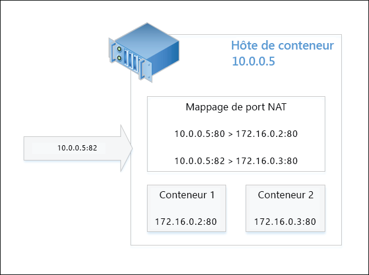
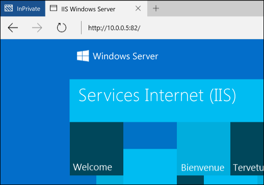

# Mise en réseau de conteneur

**Il s’agit d’un contenu préliminaire qui peut faire l’objet de modifications.** 

Sur le plan de la mise en réseau, les conteneurs Windows fonctionnent de la même façon que des machines virtuelles. Chaque conteneur a une carte réseau virtuelle qui est connectée à un commutateur virtuel sur lequel le trafic entrant et sortant est transféré. Pour appliquer une isolation entre les conteneurs sur le même hôte, un compartiment réseau est créé pour chaque conteneur Windows Server et Hyper-V dans lequel est installée la carte réseau pour le conteneur. Les conteneurs Windows Server utilisent une carte réseau virtuelle hôte pour s’attacher au commutateur virtuel. Les conteneurs Hyper-V utilisent une carte réseau de machine virtuelle synthétique (non exposée à la machine virtuelle d’utilitaire) pour s’attacher au commutateur virtuel.

Les conteneurs Windows prennent en charge quatre modes de mise en réseau différents.

- **Mode traduction d’adresses réseau (NAT)** : Chaque conteneur est connecté à un commutateur virtuel interne et utilise WinNAT pour se connecter à un sous-réseau IP privé. WinNAT effectue à la fois la traduction d’adresses réseau (NAT) et la traduction d’adresses de port (PAT) entre l’hôte de conteneur et les conteneurs eux-mêmes.

- **Mode transparent** : Chaque conteneur est connecté à un commutateur virtuel externe et est directement attaché au réseau physique. Les adresses IP peuvent être attribuées de façon statique ou dynamique à l’aide d’un serveur DHCP externe. Les trames de trafic réseau de conteneur brutes sont placées directement sur le réseau physique sans aucune traduction d’adresses.

- **Mode pont de couche 2** : Chaque conteneur est connecté à un commutateur virtuel externe. Le trafic réseau entre deux conteneurs dans le même sous-réseau IP et attachés au même hôte de conteneur est directement relié par un pont. Le trafic réseau entre deux conteneurs sur différents sous-réseaux IP ou attachés à différents hôtes de conteneur est envoyé via le commutateur virtuel externe. En sortie, le trafic réseau provenant du conteneur aura l’adresse MAC source réécrite sur celle de l’hôte de conteneur. En entrée, le trafic réseau destiné à un conteneur a l’adresse MAC de destination réécrite sur celle du conteneur lui-même.

- **Mode tunnel de couche 2** - *(ce mode ne doit être utilisé que dans une pile cloud Microsoft)*. Similaire au mode pont de couche 2, chaque conteneur est connecté à un commutateur virtuel externe avec les adresses MAC réécrites en entrée et en sortie. Toutefois, TOUT le trafic réseau de conteneur est transmis au commutateur virtuel de l’hôte physique, quelle que soit la connectivité de couche 2. Cela permet d’appliquer une stratégie réseau au commutateur virtuel de l’hôte physique, comme programmé par les niveaux supérieurs de la pile de mise en réseau (par exemple, le contrôleur de réseau ou le fournisseur de ressources réseau).

Ce document décrit en détail l’avantage et la configuration de chacun de ces modes.

## Créer un réseau

### Vue d'ensemble

PowerShell ou Docker peut être utilisé pour créer des réseaux de conteneurs, relier des conteneurs à un réseau et configurer des règles de réacheminement de port. Plus loin, nous nous concentrerons sur les commandes de mise en réseau Docker basées sur le modèle CNM (Cloud Network Model) de Docker.

La liste des pilotes acceptables pour la création d’un réseau Docker sont « transparent », « nat » et « l2bridge ». Comme nous l’avons indiqué, le pilote de tunnel de couche 2 ne doit être utilisé que dans les scénarios de déploiement de cloud public Microsoft Azure. 

> Les noms des pilotes réseau Docker s’écrivent en minuscules.

Le démon Docker fait référence à différents modes de mise en réseau selon le nom du pilote utilisé pour créer le réseau. Par exemple, le mode de mise en réseau NAT dispose d’un pilote réseau Docker correspondant nommé nat. Par défaut, le moteur Docker sur Windows recherche un réseau avec un pilote nat. S’il n’existe pas de réseau NAT, le moteur Docker en crée un. Tous les conteneurs créés sont attachés au réseau nat par défaut.

Ce comportement (utilisation d’un pilote réseau NAT par défaut) peut être remplacé en spécifiant un « pont » spécifique nommé « none » à l’aide de l’option -b none lors du démarrage du moteur de démon Docker.

Pour arrêter le service, utilisez la commande PowerShell suivante :

```none
Stop-Service docker
```

Le fichier de configuration est accessible sur `c:\programdata\docker\runDockerDaemon.cmd`. Modifiez la ligne suivante, puis ajoutez `-b "none"`

```none
dockerd <options> -b “none”
```

Redémarrez le service.

```none
Start-Service docker
```

Quand vous exécutez le démon Docker avec -b « none », un réseau spécifique doit être créé et référencé lors de la création/du démarrage du conteneur.

Pour répertorier les réseaux de conteneurs disponibles sur l’hôte, utilisez les commandes Docker ou PowerShell suivantes.

```none
docker network ls
```
Qui produira un résultat semblable à :

```none
NETWORK ID          NAME                DRIVER
bd8b691a8286        nat                 nat
7b055c7ed373        none                null
```
Ou l’équivalent avec PowerShell :


```none
Get-ContainerNetwork |fl
```

Qui produira un résultat semblable à :

```none
Name               : nat
SubnetPrefix       : {172.16.0.0/12}
Gateways           : {172.16.0.1}
Id                 : 67ea1851-326d-408b-a5ef-7dcdb15c4438
Mode               : NAT
NetworkAdapterName :
SourceMac          :
DNSServers         : {10.222.118.22, 10.221.228.12, 10.222.114.67}
DNSSuffix          : corp.microsoft.com
IsDeleted          : False
```

> Dans PowerShell, les noms de modes de mise en réseau ne respectent pas la casse.


### Mise en réseau NAT

**Traduction d’adresses réseau (NAT)**  : Ce mode de mise en réseau est utile pour affecter rapidement des adresses IP privées aux conteneurs. Un accès externe au conteneur est assuré via le mappage d’un port entre l’adresse IP externe et le port (hôte de conteneur), et l’adresse IP interne et le port du conteneur. Tout le trafic réseau reçu sur la combinaison adresse IP externe/port est comparé à une table de mappage de port WinNAT et transmis à l’adresse IP et au port de conteneur appropriés. De plus, NAT permet à plusieurs conteneurs d’héberger des applications qui peuvent nécessiter des ports de communication (internes) identiques en les mappant à des ports externes uniques. Windows prend uniquement en charge un préfixe interne de réseau NAT par hôte. Pour plus d’informations, lisez le billet de blog [WinNAT capabilities and limitations](https://blogs.technet.microsoft.com/virtualization/2016/05/25/windows-nat-winnat-capabilities-and-limitations/) 

> Depuis TP5, une règle de pare-feu est automatiquement créée pour tous les mappages de ports statiques NAT. Cette règle de pare-feu affecte globalement l’hôte de conteneur et n’est pas limitée à une carte réseau ni un point de terminaison de conteneur spécifique.

#### Configuration de l’hôte <!--1-->

Pour utiliser le mode de mise en réseau NAT, créez un réseau de conteneurs avec le nom de pilote « nat ». 

> Comme un seul réseau par défaut _nat_ peut être créé par hôte, vérifiez que vous créez seulement un réseau NAT quand tous les autres réseaux NAT ont été supprimés et que le démon Docker est exécuté avec l’option -b "none". Par ailleurs, si vous souhaitez simplement contrôler quel réseau IP interne est utilisé par NAT, vous pouvez ajouter l’option _--fixed-cidr=<préfixe interne NAT / masque>_ à la commande dockerd dans C:\ProgramData\docker\runDockerDaemon.cmd.

```none
docker network create -d nat MyNatNetwork [--subnet=<string[]>] [--gateway=<string[]>]
```

Pour créer un réseau NAT à l’aide de PowerShell, la syntaxe suivante doit être utilisée. Notez que des paramètres supplémentaires, dont DNSServers et DNSSuffix, peuvent être spécifiés à l’aide de PowerShell. S’ils ne sont pas spécifiés, ces paramètres sont hérités de l’hôte de conteneur.

```none
New-ContainerNetwork -Name MyNatNetwork -Mode NAT -SubnetPrefix "172.16.0.0/12" [-GatewayAddress <address>] [-DNSServers <address>] [-DNSSuffix <string>]
```

> Il existe un bogue connu dans Windows Server 2016 Technical Preview 5 et les builds récentes de WIP (Windows Insider Preview) où la mise à niveau vers une nouvelle build aboutit à un commutateur virtuel et un réseau de conteneurs en double. Pour contourner ce problème, exécutez le script suivant.
```none
PS> $KeyPath = "HKLM:\SYSTEM\CurrentControlSet\Services\vmsmp\parameters\SwitchList"
PS> $keys = get-childitem $KeyPath
PS> foreach($key in $keys)
PS> {
PS>    if ($key.GetValue("FriendlyName") -eq 'nat')
PS>    {
PS>       $newKeyPath = $KeyPath+"\"+$key.PSChildName
PS>       Remove-Item -Path $newKeyPath -Recurse
PS>    }
PS> }
PS> remove-netnat -Confirm:$false
PS> Get-ContainerNetwork | Remove-ContainerNetwork
PS> Get-VmSwitch -Name nat | Remove-VmSwitch (_failure is expected_)
PS> Stop-Service docker
PS> Set-Service docker -StartupType Disabled
Reboot Host
PS> Get-NetNat | Remove-NetNat
PS> Set-Service docker -StartupType automatic
PS> Start-Service docker 
```

### Mise en réseau transparente

**Mise en réseau transparente** : Ce mode de mise en réseau ne doit être utilisé que dans les très petits déploiements où une connectivité directe entre les conteneurs et le réseau physique est indispensable. Dans cette configuration, tous les services réseau exécutés dans un conteneur sont accessibles directement à partir du réseau physique. Les adresses IP peuvent être attribuées de façon statique, en supposant qu’elles se trouvent dans le préfixe de sous-réseau IP du réseau physique et n’entrent pas en conflit avec d’autres adresses IP sur le réseau physique. Les adresses IP peuvent également être attribuées de façon dynamique à partir d’un serveur DHCP externe sur le réseau physique. Si DHCP n’est pas utilisé pour l’attribution d’adresses IP, vous pouvez spécifier une adresse IP de passerelle. 

#### Configuration de l’hôte <!--2-->

Pour utiliser le mode de mise en réseau transparent, créez un réseau de conteneurs avec le nom de pilote « transparent ». 

```none
docker network create -d transparent MyTransparentNetwork
```

Dans cet exemple, le réseau transparent est créé et une passerelle lui est affectée.

```none
docker network create -d transparent --gateway=10.50.34.1 "MyTransparentNet"
```

Si l’hôte de conteneur est virtualisé et que vous souhaitez utiliser DHCP pour l’attribution d’adresses IP, vous devez activer MACAddressSpoofing sur la carte réseau de machines virtuelles.

```none
Get-VMNetworkAdapter -VMName ContainerHostVM | Set-VMNetworkAdapter -MacAddressSpoofing On
```

> Si vous souhaitez créer plusieurs réseaux transparents (ou l2bridge), vous devez spécifier la carte réseau (virtuelle) à laquelle le commutateur virtuel Hyper-V externe (créé automatiquement) doit être lié.
 
### Mise en réseau en mode pont de couche 2

**Mise en réseau en mode pont de couche 2** : Dans cette configuration, l’extension vSwitch VFP (Virtual Filtering Platform) dans l’hôte de conteneur fait office de pont et effectue une traduction d’adresses de couche 2 (réécriture d’adresses MAC) en fonction des besoins. Les adresses IP de couche 3 et les ports de couche 4 restent inchangés. Les adresses IP peuvent être attribuées de façon statique pour correspondre au préfixe de sous-réseau IP du réseau physique ou, si vous utilisez un déploiement de cloud privé Microsoft, à une adresse IP à partir du préfixe de sous-réseau du réseau virtuel.

#### Configuration de l’hôte <!--3-->

Pour utiliser le mode de mise en réseau pont de couche 2, créez un réseau de conteneurs avec le nom de pilote « l2bridge ». Un sous-réseau et une passerelle doivent également être spécifiés lors de la création d’un réseau L2Bridge.

```none
docker network create -d l2bridge --subnet=192.168.1.0/24 --gateway=192.168.1.1 MyBridgeNetwork
```

## Supprimer un réseau

Utilisez `docker network rm` pour supprimer un réseau de conteneurs.

```none
docker network rm "<network name>"
```
Ou `Remove-ContainerNetwork` avec PowerShell :

Cela permet de nettoyer tous les commutateurs virtuels Hyper-V utilisés par le réseau de conteneurs ainsi que tous les objets de traduction d’adresses réseau créés pour les réseaux de conteneurs nat.

## Options réseau

Différentes options de mise en réseau Docker peuvent être spécifiées quand le réseau de conteneurs ou un conteneur lui-même est créé. Outre l’option -d (--driver=<network mode>) pour indiquer le mode de mise en réseau, les options --gateway, --subnet et -o sont également prises en charge lors de la création d’un réseau de conteneurs.

### Options supplémentaires

Une adresse IP de passerelle peut être spécifiée à l’aide de `--gateway`. Cette opération doit être effectuée uniquement lors de l’utilisation d’adresses IP attribuées de façon statique (réseaux transparents).

```none
docker network create -d transparent --gateway=10.50.34.1 "MyTransparentNet"
```

Un préfixe de sous-réseau IP peut être spécifié à l’aide de `--subnet`, qui contrôle le segment réseau à partir duquel les adresses IP sont allouées.

```none
docker network create -d nat --subnet=192.168.0.0/24 "MyCustomNatNetwork"
```
Vous pouvez personnaliser davantage un réseau de conteneurs via Docker à l’aide du paramètre -o (--opt=map[]). 

Pour spécifier la carte réseau dans l’hôte de conteneur à utiliser pour un réseau Transparent, L2Bridge ou L2 Tunnel, spécifiez l’option *com.docker.network.windowsshim.interface*. 
```none
docker network create -d transparent -o com.docker.network.windowsshim.interface="Ethernet 2" "TransparentNetTwo"
```

La valeur pour *com.docker.network.windowsshim.interface* est le *Nom* de la carte provenant de : 
```none
Get-NetAdapter
```

> Les réseaux de conteneurs qui sont créés via PowerShell ne sont pas disponibles dans Docker jusqu’au redémarrage du démon Docker. Toutes les autres modifications apportées à un réseau de conteneurs via PowerShell nécessitent également un redémarrage du démon Docker.

### Plusieurs réseaux de conteneurs

Plusieurs réseaux de conteneurs peuvent être créés sur un hôte de conteneur unique avec les mises en garde suivantes :
* Un seul réseau NAT peut être créé par hôte de conteneur.
* Plusieurs réseaux qui utilisent un vSwitch externe pour la connectivité (par exemple, Transparent, L2 Bridge, L2 Transparent) doivent chacun utiliser leur propre carte réseau.

### Sélection du réseau

Quand vous créez un conteneur Windows, vous pouvez spécifier un réseau auquel la carte réseau de conteneur est connectée. Si aucun réseau n’est spécifié, le réseau NAT par défaut est utilisé.

Pour pouvoir attacher un conteneur au réseau NAT non défini par défaut (ou quand -b « none » est utilisé), employez l’option --net avec la commande run Docker.

```none
docker run -it --net=MyTransparentNet windowsservercore cmd
```

### Adresse IP statique

Les adresses IP statiques sont définies sur la carte réseau des conteneurs et sont uniquement prises en charge dans les modes de mise en réseau NAT, Transparent ([PR](https://github.com/docker/docker/pull/22208) en attente) et L2Bridge. En outre, l’attribution d’adresses IP statiques n’est pas prise en charge pour le réseau « nat » par défaut via Docker.

```none
docker run -it --net=MyTransparentNet --ip=10.80.123.32 windowsservercore cmd
```

L’attribution d’adresses IP statiques est effectuée directement sur la carte réseau du conteneur et ne doit être réalisée que quand le conteneur est dans un état ARRÊTÉ. Ni un « ajout à chaud » de cartes réseau de conteneurs ni un apport de modifications à la pile réseau ne sont pris en charge pendant l’exécution du conteneur.

```none
Get-ContainerNetworkAdapter -ContainerName "DemoNAT"

ContainerName Name            Network Id                           Static MacAddress Static IPAddress Maximum Bandwidth
------------- ----            ----------                           ----------------- ---------------- -----------------
DemoNAT       Network Adapter C475D31C-FB42-408E-8493-6DB6C9586915                              0

Set-ContainerNetworkAdapter -ContainerName "DemoNAT" -StaticIPAddress 172.16.0.100
```

Si vous préférez que l’adresse IP soit choisie automatiquement à partir de la plage spécifiée dans le préfixe de sous-réseau du réseau de conteneurs, démarrez le conteneur sans appliquer les paramètres à la carte réseau.

> L’attribution d’adresses IP statiques via PowerShell ne fonctionne pas sur les points de terminaison de conteneur attachés à un réseau Transparent.

Pour afficher les conteneurs qui sont connectés à un réseau spécifique et les adresses IP associées à ces points de terminaison de conteneur, vous pouvez exécuter la commande suivante.

```none
docker network inspect nat
```

### Créer une adresse MAC

Une adresse MAC peut être spécifiée à l’aide de l’option `--mac-address`.

```none
docker run -it --mac="92:d0:c6:0a:29:33" --name="MyContainer" windowsservercore cmd
```

### Mappage de ports

Pour accéder à des applications à l’intérieur d’un conteneur connecté à un réseau NAT, des mappages de ports doivent être créés entre l’hôte de conteneur et la carte réseau de conteneur. Ces mappages doivent être créés alors que le conteneur est dans un état ARRÊTÉ.

Cet exemple montre comment créer un mappage statique entre le port **80** de l’hôte de conteneur et le port **80** du conteneur.

```none
docker run -it --name=DemoNat -p 80:80 windowsservercore cmd
```

Cet exemple montre comment créer un mappage statique entre le port **8082** de l’hôte de conteneur et le port **80** du conteneur.

```none
docker run -it --name=DemoNat -p 8082:80 windowsservercore cmd
```

Les mappages de ports dynamiques sont également pris en charge via Docker de façon à ce qu’un utilisateur n’ait pas besoin de spécifier un port spécifique à mapper à partir de l’hôte de conteneur. Un port éphémère est choisi au hasard sur l’hôte de conteneur et peut être inspecté lors de l’exécution de docker ps.

```none
docker run -itd --name=DemoNat -p 80 windowsservercore cmd

docker ps
CONTAINER ID        IMAGE               COMMAND             CREATED             STATUS              PORTS                   NAMES
bbf72109b1fc        windowsservercore   "cmd"               6 seconds ago       Up 2 seconds        *0.0.0.0:14824->80/tcp*   DemoNat
```

Dans cet exemple, le port TCP 80 du conteneur DemoNat est exposé en externe à partir de l’hôte de conteneur sur le port 14824.

Une fois le mappage de ports créé, l’application d’un conteneur est accessible via l’adresse IP de l’hôte de conteneur (physique ou virtuel) et un port externe exposé. Par exemple, le schéma ci-dessous décrit une configuration NAT avec une demande ciblant le port externe **82** de l’hôte de conteneur. Sur la base du mappage de ports, cette demande renvoie l’application hébergée dans le conteneur 2.



Vue de la demande à partir d’un navigateur Internet.



## Mises en garde et pièges

### Pare-feu

L’hôte de conteneur nécessite la création de règles de pare-feu spécifiques pour activer ICMP (Ping) et DHCP. ICMP et DHCP sont nécessaires aux conteneurs Windows Server pour effectuer un test ping entre deux conteneurs sur le même hôte et pour recevoir dynamiquement des adresses IP attribuées via DHCP. Dans TP5, ces règles sont créées via le script Install-ContainerHost.ps1. Après TP5, ces règles seront créées automatiquement. Toutes les règles de pare-feu correspondant aux règles de réacheminement de port NAT sont créées automatiquement et nettoyées lors de l’arrêt du conteneur.

### Fonctionnalités non prises en charge

Les fonctionnalités de mise en réseau suivantes ne sont pas prises en charge pour le moment via l’interface de ligne de commande Docker
 * liaison de conteneurs (par exemple, --link)
 * résolution d’adresses IP en fonction du nom pour les conteneurs

Les options réseau suivantes ne sont pas prises en charge sur Windows Docker à ce stade :
 * --add-host
 * --dns
 * --dns-opt
 * --dns-search
 * -h, --hostname
 * --net-alias
 * --aux-address
 * --internal
 * --ip-range


<!--HONumber=Jul16_HO5-->


