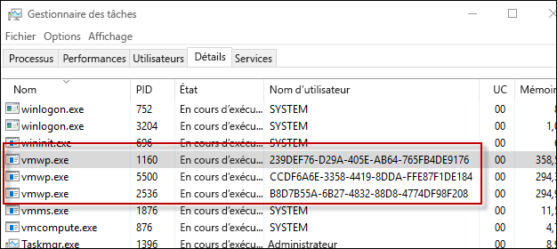

# Conteneurs Hyper-V

**Il s’agit d’un contenu préliminaire qui peut faire l’objet de modifications.** 

La technologie de conteneur Windows comprend deux types distincts de conteneurs, les conteneurs Windows Server et les conteneurs Hyper-V. Les deux types de conteneurs sont créés, sont gérés et fonctionnent de manière identique.  Ils produisent et consomment même les mêmes images de conteneurs. La différence entre eux est le niveau d’isolation créé entre le conteneur, le système d’exploitation hôte et tous les autres conteneurs exécutés sur cet hôte.

**Conteneurs Windows Server** : Plusieurs instances de conteneurs peuvent s’exécuter simultanément sur un hôte avec une isolation assurée par le biais des technologies des espaces de noms, du contrôle des ressources et de l’isolation des processus.  Les conteneurs Windows Server partagent le même noyau avec l’hôte ainsi qu’entre eux-mêmes.

**Conteneurs Hyper-V** : Plusieurs instances de conteneurs peuvent s’exécuter simultanément sur un hôte. Cependant, chaque conteneur s’exécute à l’intérieur d’une machine virtuelle spéciale. Ceci fournit une isolation de niveau noyau entre chaque conteneur Hyper-V et l’hôte des conteneurs.

## Conteneur Hyper-V PowerShell

### Créer un conteneur

Un conteneur Hyper-V est créé de la même manière qu’un conteneur Windows Server, la seule différence étant un paramètre d’exécution qui indique qu’il s’agit d’un conteneur Hyper-V.

Exemple de création d’un conteneur Hyper-V avec PowerShell

```powershell
PS C:\> $con = New-Container -Name HYPVCON -ContainerImageName NanoServer -SwitchName "Virtual Switch" -RuntimeType HyperV
```

### Convertir un conteneur

En plus de la création d’un conteneur comme conteneur Hyper-V au moment de la génération, les conteneurs qui ont été créés avec PowerShell peuvent également faire l’objet d’une conversion de conteneur Windows Server en conteneur Hyper-V.

> Actuellement, le seul système d’exploitation hôte qui prend en charge la conversion d’exécution de conteneur est Nano Server.

Créez un conteneur avec l’exécution par défaut. 

```powershell
PS C:\> $con = New-Container -Name DEMO -ContainerImageName nanoserver -SwitchName NAT
```
Retournez la propriété d’exécution du conteneur, notez que l’exécution est définie avec la valeur par défaut. 

```powershell
PS C:\> Get-Container | Select ContainerName, RuntimeType

ContainerName RuntimeType
------------- -----------
DEMO              Default
```

Pour changer l’environnement d’exécution du conteneur, utilisez la commande `set-container`.

```powershell
PS C:\> Set-Container $con -RuntimeType HyperV
```

Enfin retournez à nouveau la propriété d’exécution pour afficher la modification.

```powershell
PS C:\> Get-Container | select ContainerName, RuntimeType

ContainerName RuntimeType
------------- -----------
DEMO               HyperV
```

## Conteneur Hyper-V Docker

### Créer un conteneur <!--docker-->

La gestion des conteneurs Hyper-V avec Docker est presque identique à la gestion des conteneurs Windows Server. Quand vous créez un conteneur Hyper-V avec Docker, le paramètre `--isolation=hyperv` est utilisé.

```powershell
docker run -it --isolation=hyperv 646d6317b02f cmd
```

## Éléments internes 

### Processus de travail de machine virtuelle

Pour chaque conteneur Hyper-V qui est créé, un processus de travail de machine virtuelle correspondant est créé.

```powershell
PS C:\> Get-Container | Select Name, RuntimeType, ContainerID | Where {$_.RuntimeType -eq 'Hyperv'}

Name RuntimeType ContainerId
---- ----------- -----------
TST3      HyperV 239def76-d29a-405e-ab64-765fb4de9176
TST       HyperV b8d7b55a-6b27-4832-88d8-4774df98f208
TST2      HyperV ccdf6a6e-3358-4419-8dda-ffe87f1de184
```

Notez que le conteneur peut être associé à un processus par le nom d’utilisateur de processus et l’ID de conteneur.

 

Cette relation peut également être affichée à l’aide de la commande `Get-ComputeProcess`.

```powershell
PS C:\> Get-ComputeProcess

Id                                   Name Owner      Type
--                                   ---- -----      ----
239DEF76-D29A-405E-AB64-765FB4DE9176 TST3 VMMS  Container
B8D7B55A-6B27-4832-88D8-4774DF98F208 TST  VMMS  Container
CCDF6A6E-3358-4419-8DDA-FFE87F1DE184 TST2 VMMS  Container
```

Pour plus d’informations sur la commande `Get-ComputeProcess`, consultez [Interopérabilité de la gestion](./hcs_powershell.md).

## Démonstration de l’isolation

### Conteneur Windows Server

L’exercice suivant permet d’illustrer l’isolation d’un conteneur Hyper-V. Dans cet exercice, un conteneur Windows Server et un conteneur Hyper-V sont tous deux créés. Le processus en cours d’exécution sur l’hôte de conteneur est examiné et montre comment le processus de conteneur Windows Server est partagé sur l’hôte de conteneur, alors que le processus de conteneur Hyper-V ne l’est pas.

```powershell
PS C:\> get-process | where {$_.ProcessName -eq 'csrss'}

Handles  NPM(K)    PM(K)      WS(K) VM(M)   CPU(s)     Id  SI ProcessName
-------  ------    -----      ----- -----   ------     --  -- -----------
    255      12     1820       4000 ...98     0.53    532   0 csrss
    116      11     1284       3700 ...94     0.25    608   1 csrss
    246      13     1844       5504 ...17     3.45   3484   2 csrss
```

Créez un conteneur Windows Server :

```powershell
PS C:\> $con = New-Container -Name WINCONT -ContainerImageName WindowsServerCore -SwitchName "Virtual Switch"
```

Démarrez le conteneur :

```powershell
PS C:\> Start-Container $con
```

Créez une session PSsession à distance avec le conteneur.

```powershell
PS C:\> Enter-PSSession -ContainerId $con.ContainerId -RunAsAdministrator
```

À partir de la session de conteneur à distance, retournez tous les processus avec le nom csrss. Notez l’ID du processus csrss en cours d’exécution (1228 dans l’exemple ci-dessous).

```powershell
[WINCONT]: PS C:\> get-process | where {$_.ProcessName -eq 'csrss'}

Handles  NPM(K)    PM(K)      WS(K) VM(M)   CPU(s)     Id  SI ProcessName
-------  ------    -----      ----- -----   ------     --  -- -----------
    167       9     1276       3720 ...97     0.20   1228   3 csrss
```

Retournez maintenant la liste de processus csrss à partir de l’hôte de conteneur. Notez que le même processus csrss est également retourné à partir de l’hôte de conteneur.

```powershell
PS C:\> get-process | where {$_.ProcessName -eq 'csrss'}

Handles  NPM(K)    PM(K)      WS(K) VM(M)   CPU(s)     Id  SI ProcessName
-------  ------    -----      ----- -----   ------     --  -- -----------
    252      11     1712       3968 ...98     0.53    532   0 csrss
    113      11     1176       3676 ...93     0.25    608   1 csrss
    175       9     1260       3708 ...97     0.20   1228   3 csrss
    243      13     1736       5512 ...17     3.77   3484   2 csrss
```
### Conteneur Hyper-V

Retournez une liste de processus csrss à partir de l’hôte de conteneur.

```powershell
PS C:\> get-process | where {$_.ProcessName -eq 'csrss'}

Handles  NPM(K)    PM(K)      WS(K) VM(M)   CPU(s)     Id  SI ProcessName
-------  ------    -----      ----- -----   ------     --  -- -----------
    261      12     1820       4004 ...98     0.53    532   0 csrss
    116      11     1284       3704 ...94     0.25    608   1 csrss
    246      13     1844       5536 ...17     3.83   3484   2 csrss
```

Créez maintenant un conteneur Hyper-V.

```powershell
PS C:\> $con = New-Container -Name HYPVCON -ContainerImageName NanoServer -SwitchName "Virtual Switch" -RuntimeType HyperV
```

Démarrez le conteneur Hyper-V.

```powershell
PS C:\> Start-Container $con
```

Créez une session PSsession à distance avec le conteneur Hyper-V.

```powershell
PS C:\> Enter-PSSession -ContainerId $con.ContainerId -RunAsAdministrator
```

Retournez une liste de processus csrss exécutés dans le conteneur Hyper-V. Notez l’ID du processus csrss (956 dans l’exemple ci-dessous).

```powershell
[HYPVCON]: PS C:\> get-process | where {$_.ProcessName -eq 'csrss'}

Handles  NPM(K)    PM(K)      WS(K) VM(M)   CPU(s)     Id  SI ProcessName
-------  ------    -----      ----- -----   ------     --  -- -----------
              4      452       1520 ...63     0.06    956   1 csrss
```

Retournez maintenant une liste de processus csrss sur l’hôte de conteneur. Notez que, contrairement au conteneur Windows Server, où le processus csrss était visible à la fois à partir du conteneur et également à partir de l’hôte de conteneur, le processus du conteneur Hyper-V est uniquement visible à partir du conteneur. En effet, un conteneur Hyper-V est encapsulé dans une machine virtuelle d’utilitaire et le processus est isolé dans cette machine virtuelle d’utilitaire seulement.

```powershell
PS C:\> get-process | where {$_.ProcessName -eq 'csrss'}

Handles  NPM(K)    PM(K)      WS(K) VM(M)   CPU(s)     Id  SI ProcessName
-------  ------    -----      ----- -----   ------     --  -- -----------
    255      12     1716       3972 ...98     0.56    532   0 csrss
    113      11     1176       3676 ...93     0.25    608   1 csrss
    243      13     1732       5512 ...18     4.23   3484   2 csrss
```

## Vidéo de la procédure pas à pas

<iframe src="https://channel9.msdn.com/Blogs/containers/Container-Fundamentals--Part-5-Hyper-V-Containers/player" width="800" height="450"  allowFullScreen="true" frameBorder="0" scrolling="no"></iframe>


<!--HONumber=Feb16_HO4-->


