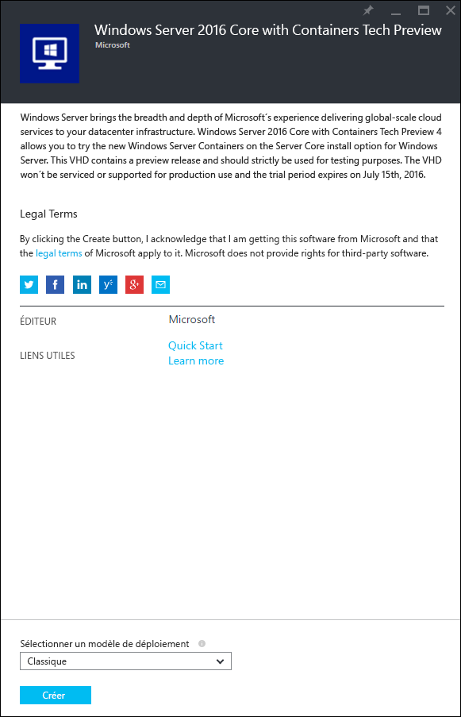
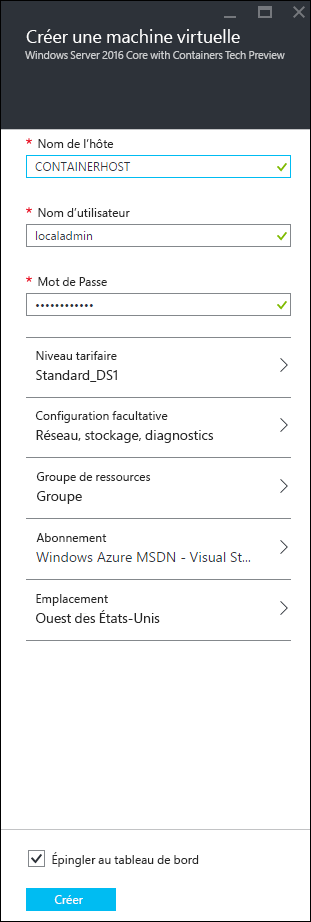

# Démarrage rapide Azure

Avant de créer et gérer des conteneurs Windows Server dans Azure, vous devez déployer une image Windows Server 2016 Technical Preview qui a été préconfigurée avec la fonctionnalité de conteneurs Windows Server. Ce guide vous aidera tout au long de ce processus.

> Microsoft Azure ne prend pas en charge les conteneurs Hyper-V. Pour effectuer les exercices de conteneur Hyper-V, vous avez besoin d’un hôte de conteneur local.

## Démarrer l’utilisation du portail Azure

Si vous avez un compte Azure, passez directement à [Créer une machine virtuelle d’hôte de conteneur](#CreateacontainerhostVM).

1. Accédez à [azure.com](https://azure.com) et suivez les étapes pour obtenir une [version d’évaluation gratuite d’Azure](https://azure.microsoft.com/en-us/pricing/free-trial/).
2. Connectez-vous avec votre compte Microsoft.
3. Quand votre compte est prêt à l’emploi, connectez-vous au [portail de gestion](https://portal.azure.com).

## Créer une machine virtuelle d’hôte de conteneur

Recherchez « conteneurs » dans Azure Marketplace, « Windows Server 2016 Core with Containers Tech Preview 4 » est retourné

Sélectionnez l’image, puis cliquez sur `Créer`.

Affectez un nom à la machine virtuelle, sélectionnez un nom d’utilisateur et un mot de passe.

Sélectionnez Configuration facultative > Points de terminaison > et entrez un point de terminaison HTTP avec un port privé et public 80, comme indiqué ci-dessous. Quand l’opération est terminée, cliquez sur OK à deux reprises.

Pour démarrer le processus de déploiement de la machine virtuelle, sélectionnez le bouton `Créer`.

Quand le déploiement de la machine virtuelle est terminé, sélectionnez le bouton Se connecter pour démarrer une session Bureau à distance avec l’hôte de conteneur Windows Server.

Connectez-vous à la machine virtuelle à l’aide du nom d’utilisateur et du mot de passe spécifiés lors de l’exécution de l’Assistant de création de machines virtuelles. Une fois connecté, examinez l’invite de commandes Windows.

## Vidéo de la procédure pas à pas

<iframe src="https://channel9.msdn.com/Blogs/containers/Quick-Start-Configure-Windows-Server-Containers-in-Microsoft-Azure/player#ccLang=fr" width="800" height="450"  allowFullScreen="true" frameBorder="0" scrolling="no"></iframe>

## Étapes suivantes : commencer à utiliser des conteneurs

Maintenant que vous disposez d’un système Windows Server 2016 exécutant la fonctionnalité de conteneur Windows Server, accédez aux guides suivants pour commencer à utiliser les conteneurs et images de conteneur Windows Server.

[Démarrage rapide : conteneurs Windows et Docker](./manage_docker.md)  
[Démarrage rapide : conteneurs Windows et PowerShell](./manage_powershell.md)

