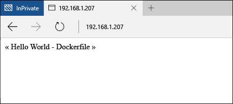

# Guide de démarrage rapide des conteneurs Windows - Docker

Les conteneurs Windows peuvent servir à déployer rapidement de nombreuses applications isolées sur un ordinateur unique. Cet exercice montre comment créer et gérer un conteneur Windows à l’aide de Docker. Quand vous aurez terminé, vous aurez compris les bases de l’intégration de Docker aux conteneurs Windows et aurez acquis une expérience pratique de la technologie.

Cette procédure pas à pas décrit en détail les conteneurs Windows Server et les conteneurs Hyper-V. Chaque type de conteneur a ses propres exigences de base. La documentation des conteneurs Windows contient une procédure permettant de déployer rapidement un hôte de conteneur. Il s’agit du moyen le plus simple pour apprendre à utiliser rapidement les conteneurs Windows. Si vous n’avez pas déjà un hôte de conteneur, consultez [Démarrage rapide du déploiement d’un hôte de conteneur](./container_setup.md).

Les éléments suivants sont nécessaires à chaque exercice.

**Conteneurs Windows Server :**

- un hôte de conteneur Windows exécutant Windows Server 2016 (Full ou Core), localement ou dans Azure.

**Conteneurs Hyper-V :**

- un hôte de conteneur Windows compatible avec la virtualisation imbriquée.
- Support Windows Server 2016 : [Télécharger](https://aka.ms/tp4/serveriso).

>Microsoft Azure ne prend pas en charge les conteneurs Hyper-V. Pour effectuer les exercices de conteneur Hyper-V, vous avez besoin d’un hôte de conteneur local.

## Conteneur Windows Server

Les conteneurs Windows Server fournissent un environnement d’exploitation isolé, portable et contrôlé par les ressources pour exécuter des applications et des processus d’hébergement. Les conteneurs Windows Server permettent d’isoler le conteneur et l’hôte, en isolant le processus et l’espace de noms.

### Créer un conteneur

Avant de créer un conteneur, utilisez la commande `docker images` pour répertorier les images de conteneur installées sur l’hôte.

```powershell
PS C:\> docker images

REPOSITORY          TAG                 IMAGE ID            CREATED             VIRTUAL SIZE
windowsservercore   10.0.10586.0        6801d964fda5        2 weeks ago         0 B
windowsservercore   latest              6801d964fda5        2 weeks ago         0 B
nanoserver          10.0.10586.0        8572198a60f1        2 weeks ago         0 B
nanoserver          latest              8572198a60f1        2 weeks ago         0 B
```

Pour cet exemple, créez un conteneur à l’aide de l’image Windows Server Core. Pour ce faire, utilisez la commande `docker run`. Pour plus d’informations sur la commande `docker run`, consultez les [informations de référence sur Docker Run sur docker.com](https://docs.docker.com/engine/reference/run/).

Cet exemple montre comment créer un conteneur nommé `iisbase`, puis comment démarrer une session interactive avec le conteneur.

```powershell
C:\> docker run --name iisbase -it windowsservercore cmd
```

Une fois le conteneur créé, vous allez utiliser une session d’interpréteur de commandes à partir du conteneur.


### Créer une image IIS

Il faut d’abord installer IIS, puis une image est créée à partir du conteneur. Pour installer IIS, exécutez la commande suivante.

```powershell
C:\> powershell.exe Install-WindowsFeature web-server
```

Une fois terminé, quittez la session interactive de l’interpréteur de commandes.

```powershell
C:\> exit
```

Enfin, le conteneur est validé dans une nouvelle image de conteneur à l’aide de la commande `docker commit`. Cet exemple crée une image de conteneur nommée `windowsservercoreiis`.

```powershell
C:\> docker commit iisbase windowsservercoreiis
4193c9f34e320c4e2c52ec52550df225b2243927ed21f014fbfff3f29474b090
```

Les nouvelles images IIS sont consultables à l’aide de la commande `docker images`.

```powershell
C:\> docker images

REPOSITORY             TAG                 IMAGE ID            CREATED             VIRTUAL SIZE
windowsservercoreiis   latest              4193c9f34e32        4 minutes ago       170.8 MB
windowsservercore      10.0.10586.0        6801d964fda5        2 weeks ago         0 B
windowsservercore      latest              6801d964fda5        2 weeks ago         0 B
nanoserver             10.0.10586.0        8572198a60f1        2 weeks ago         0 B
nanoserver             latest              8572198a60f1        2 weeks ago         0 B
```

### Configurer le réseau

Avant de créer un conteneur avec Docker, vous devez créer une règle pour le Pare-feu Windows qui autorise la connectivité réseau vers le conteneur. Exécutez la commande suivante pour créer une règle pour le port 80.

```powershell
if (!(Get-NetFirewallRule | where {$_.Name -eq "TCP80"})) {
    New-NetFirewallRule -Name "TCP80" -DisplayName "HTTP on TCP/80" -Protocol tcp -LocalPort 80 -Action Allow -Enabled True
}
```

Vous pouvez également noter l’adresse IP de l’hôte de conteneur. Elle sera utilisée tout au long de l’exercice.

### Créer un conteneur IIS

Vous disposez maintenant d’une image de conteneur qui contient IIS et permet de déployer des environnements d’exploitation compatibles avec IIS.

Pour créer un conteneur à partir de la nouvelle image, utilisez la commande `docker run`, cette fois en spécifiant le nom de l’image IIS. Notez que cet exemple a spécifié un paramètre `-p 80:80`. Étant donné que le conteneur est connecté à un commutateur virtuel qui fournit des adresses IP par la traduction d’adresses réseau, un port de l’hôte de conteneur doit être mappé à un port sur l’adresse IP NAT des conteneurs. Pour plus d’informations sur `-p`, consultez les [informations de référence sur Docker Run sur docker.com](https://docs.docker.com/engine/reference/run/)

```powershell
C:\> docker run --name iisdemo -it -p 80:80 windowsservercoreiis cmd
```

Une fois le conteneur créé, ouvrez un navigateur et accédez à l’adresse IP de l’hôte de conteneur. Étant donné que le port 80 de l’hôte a été mappé au port 80 du conteneur, l’écran de démarrage IIS doit s’afficher.


### Créer une application

Exécutez la commande suivante pour supprimer l’écran de démarrage IIS.

```powershell
C:\> del C:\inetpub\wwwroot\iisstart.htm
```

Exécutez la commande suivante pour remplacer le site IIS par défaut par un nouveau site statique.

```powershell
C:\> echo "Hello World From a Windows Server Container" > C:\inetpub\wwwroot\index.html
```

Accédez de nouveau à l’adresse IP de l’hôte de conteneur. Vous devez maintenant voir l’application « Hello World ». Remarque : vous devez peut-être fermer toutes les connexions de navigateur existantes ou effacer le cache du navigateur pour voir l’application mise à jour.


Quittez la session interactive avec le conteneur.

```powershell
C:\> exit
```

Supprimer le conteneur

```powershell
C:\> docker rm iisdemo
```
Supprimez l’image IIS.

```powershell
C:\> docker rmi windowsservercoreiis
```

## Dockerfile

Dans l’exercice précédent, un conteneur a été manuellement créé, modifié, puis capturé dans une nouvelle image de conteneur. Docker inclut une méthode pour automatiser ce processus, à l’aide de ce que l’on appelle un fichier dockerfile. Cet exercice permet d’obtenir les mêmes résultats que le précédent, mais avec un processus entièrement automatisé.

### Créer une image IIS

Dans l’hôte de conteneur, créez un répertoire `c:\build` dans lequel vous créez un fichier nommé `dockerfile`.

```powershell
C:\> powershell new-item c:\build\dockerfile -Force
```

Ouvrez le fichier dockerfile dans le Bloc-notes.

```powershell
C:\> notepad c:\build\dockerfile
```

Copiez le texte suivant dans le fichier dockerfile et enregistrez-le. Ces commandes indiquent à Docker de créer une image en se servant de `windosservercore` comme base, puis d’inclure les modifications spécifiées avec `RUN`. Pour plus d’informations sur les fichiers Dockerfile, consultez les [informations de référence sur Docker Run sur docker.com](http://docs.docker.com/engine/reference/builder/).

```powershell
FROM windowsservercore
RUN dism /online /enable-feature /all /featurename:iis-webserver /NoRestart
RUN echo "Hello World - Dockerfile" > c:\inetpub\wwwroot\index.html
```

Cette commande démarre le processus de génération automatique de l’image. Le paramètre `-t` indique au processus de nommer la nouvelle image `iis`.

```powershell
C:\> docker build -t iis c:\Build
```

Une fois l’opération terminée, vous pouvez vérifier que l’image a été créée à l’aide de la commande `docker images`.

```powershell
C:\> docker images

REPOSITORY          TAG                 IMAGE ID            CREATED             VIRTUAL SIZE
iis                 latest              abb93867b6f4        26 seconds ago      209 MB
windowsservercore   10.0.10586.0        6801d964fda5        2 weeks ago         0 B
windowsservercore   latest              6801d964fda5        2 weeks ago         0 B
nanoserver          10.0.10586.0        8572198a60f1        2 weeks ago         0 B
nanoserver          latest              8572198a60f1        2 weeks ago         0 B
```

### Déployer un conteneur IIS

À présent, comme dans l’exercice précédent, déployez le conteneur en mappant le port 80 de l’hôte au port 80 du conteneur.

```powershell
C:\> docker run --name iisdemo -it -p 80:80 iis cmd
```

Une fois le conteneur créé, accédez à l’adresse IP de l’hôte de conteneur. Vous devez voir l’application hello world.



Quittez la session interactive avec le conteneur.

```powershell
C:\> exit
```

Supprimer le conteneur

```powershell
C:\> docker rm iisdemo
```
Supprimez l’image IIS.

```powershell
C:\> docker rmi iis
```

## Conteneur Hyper-V

Les conteneurs Hyper-V fournissent une couche d’isolement supplémentaire sur les conteneurs Windows Server. Chaque conteneur Hyper-V est créé dans une machine virtuelle hautement optimisée. Quand un conteneur Windows Server partage un noyau avec l’hôte de conteneur, le conteneur Hyper-V est complètement isolé. Les conteneurs Hyper-V sont créés et gérés comme les conteneurs Windows Server. Pour plus d’informations sur les conteneurs Hyper-V, consultez [Gestion des conteneurs Hyper-V](../management/hyperv_container.md).

>Microsoft Azure ne prend pas en charge les conteneurs Hyper-V. Dans le cadre des exercices Hyper-V, vous avez besoin d’un hôte de conteneur local.

### Créer un conteneur

Étant donné que le conteneur exécute une image de système d’exploitation Nano Server, les packages Nano Server IIS sont nécessaires pour installer IIS. Ceux-ci se trouvent dans le support d’installation de Windows Server 2016 TP4, sous le répertoire `NanoServer\Packages`.

Dans cet exemple, un répertoire de l’hôte du conteneur devient accessible au conteneur en cours d’exécution à l’aide du paramètre `-v` de `docker run`. Avant cela, le répertoire source doit être configuré.

Créez un répertoire sur l’hôte de conteneur, qui sera partagé avec le conteneur. Si vous avez déjà effectué la procédure pas à pas PowerShell, ce répertoire et les fichiers nécessaires existent déjà.

```powershell
C:\> powershell New-Item -Type Directory c:\share\en-us
```

Copiez `Microsoft-NanoServer-IIS-Package.cab` à partir de `NanoServer\Packages` dans `c:\share` sur l’hôte du conteneur.

Copiez `NanoServer\Packages\en-us\Microsoft-NanoServer-IIS-Package.cab` dans `c:\share\en-us` sur l’hôte du conteneur.

Créez un fichier dans le dossier c:\share nommé unattend.xml et copiez-y ce texte.

```powershell
<?xml version="1.0" encoding="utf-8"?>
<unattend xmlns="urn:schemas-microsoft-com:unattend">
    <servicing>
        <package action="install">
            <assemblyIdentity name="Microsoft-NanoServer-IIS-Package" version="10.0.10586.0" processorArchitecture="amd64" publicKeyToken="31bf3856ad364e35" language="neutral" />
            <source location="c:\iisinstall\Microsoft-NanoServer-IIS-Package.cab" />
        </package>
        <package action="install">
            <assemblyIdentity name="Microsoft-NanoServer-IIS-Package" version="10.0.10586.0" processorArchitecture="amd64" publicKeyToken="31bf3856ad364e35" language="en-US" />
            <source location="c:\iisinstall\en-us\Microsoft-NanoServer-IIS-Package.cab" />
        </package>
    </servicing>
</unattend>
```

Une fois l’opération terminée, le répertoire `c:\share` sur l’hôte du conteneur doit être configuré comme suit.

```
c:\share
|-- en-us
|    |-- Microsoft-NanoServer-IIS-Package.cab
|
|-- Microsoft-NanoServer-IIS-Package.cab
|-- unattend.xml
```

Pour créer un conteneur Hyper-V à l’aide de Docker, spécifiez le paramètre `--isolation=hyperv`. Cet exemple monte le répertoire `c:\share` de l’hôte dans le répertoire `c:\iisinstall` du conteneur, puis crée une session d’interpréteur de commandes interactive avec le conteneur.

```powershell
C:\> docker run --name iisnanobase -it -v c:\share:c:\iisinstall --isolation=hyperv nanoserver cmd
```

### Créer une image IIS

À partir de la session d’interpréteur de commandes du conteneur, IIS peut être installé à l’aide de `dism`. Exécutez la commande suivante pour installer IIS dans le conteneur.

```powershell
C:\> dism /online /apply-unattend:c:\iisinstall\unattend.xml
```

Une fois l’installation d’IIS terminée, démarrez manuellement IIS avec la commande suivante.

```powershell
C:\> Net start w3svc
```

Quittez la session du conteneur.

```powershell
C:\> exit
```

### Créer un conteneur IIS

Le conteneur Nano Server modifié peut maintenant être validé dans une nouvelle image de conteneur. Pour ce faire, utilisez la commande `docker commit`.

```powershell
C:\> docker commit iisnanobase nanoserveriis
```

Les résultats peuvent être consultés dans la liste des images de conteneur.

```powershell
C:\> docker images

REPOSITORY          TAG                 IMAGE ID            CREATED              VIRTUAL SIZE
nanoserveriis       latest              444435a4e30f        About a minute ago   69.14 MB
windowsservercore   10.0.10586.0        6801d964fda5        2 weeks ago          0 B
windowsservercore   latest              6801d964fda5        2 weeks ago          0 B
nanoserver          10.0.10586.0        8572198a60f1        2 weeks ago          0 B
nanoserver          latest              8572198a60f1        2 weeks ago          0 B
```

### Créer une application

L’image Nano Server IIS peut désormais être déployée dans un nouveau conteneur.

```powershell
C:\> docker run -it -p 80:80 --isolation=hyperv nanoserveriis cmd
```

Exécutez la commande suivante pour supprimer l’écran de démarrage IIS.

```powershell
C:\> del C:\inetpub\wwwroot\iisstart.htm
```

Exécutez la commande suivante pour remplacer le site IIS par défaut par un nouveau site statique.

```powershell
C:\> echo "Hello World From a Hyper-V Container" > C:\inetpub\wwwroot\index.html
```

Accédez à l’adresse IP de l’hôte de conteneur. Vous devez maintenant voir l’application « Hello World ». Remarque : vous devez peut-être fermer toutes les connexions de navigateur existantes ou effacer le cache du navigateur pour voir l’application mise à jour.


Quittez la session interactive avec le conteneur.

```powershell
C:\> exit
```


<!--HONumber=Jan16_HO1-->
