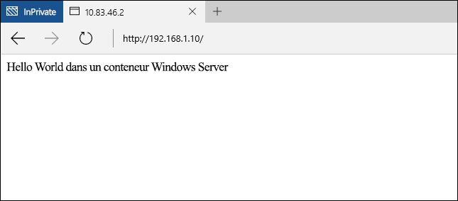

# Guide de démarrage rapide des conteneurs Windows - PowerShell

Les conteneurs Windows peuvent servir à déployer rapidement de nombreuses applications isolées sur un ordinateur unique. Ce guide de démarrage rapide décrit le déploiement et la gestion de conteneurs Windows Server et Hyper-V à l’aide de PowerShell. Tout au long de cet exercice, vous allez créer entièrement une application très simple « hello world », qui s’exécute dans un conteneur Windows Server et un conteneur Hyper-V. Pendant ce processus, vous allez créer des images de conteneur, utiliser des dossiers partagés de conteneur et gérer le cycle de vie du conteneur. Une fois terminé, vous aurez acquis une compréhension de base du déploiement et de la gestion de conteneurs Windows.

Cette procédure pas à pas décrit en détail les conteneurs Windows Server et Hyper-V. Chaque type de conteneur a ses propres exigences de base. La documentation des conteneurs Windows contient une procédure permettant de déployer rapidement un hôte de conteneur. Il s’agit du moyen le plus simple pour apprendre à utiliser rapidement les conteneurs Windows. Si vous n’avez pas d’hôte de conteneur, voir [Guide de démarrage rapide du déploiement d’un hôte de conteneur](./container_setup.md).

Les éléments suivants sont nécessaires pour chaque exercice.

**Conteneurs Windows Server :**

- Un hôte de conteneur Windows exécutant Windows Server 2016 Core, localement ou dans Azure.

**Conteneurs Hyper-V :**

- un hôte de conteneur Windows compatible avec la virtualisation imbriquée.
- Support Windows Server 2016 : [Télécharger](https://aka.ms/tp4/serveriso).

> Microsoft Azure ne prend pas en charge les conteneurs Hyper-V. Dans le cadre des exercices Hyper-V, vous avez besoin d’un hôte de conteneur local.

## Conteneur Windows Server

Les conteneurs Windows Server fournissent un environnement d’exploitation isolé, portable et contrôlé par les ressources pour exécuter des applications et des processus d’hébergement. Les conteneurs Windows Server permettent d’isoler le conteneur et l’hôte ainsi que chaque conteneur s’exécutant sur l’hôte, en isolant les processus et l’espace de noms.

### Créer un conteneur

Au moment de TP4, les conteneurs Windows Server s’exécutant sur un ordinateur Windows Server 2016 ou Windows Server 2016 Core ont besoin de l’image de système d’exploitation Windows Server 2016 Core.

Démarrez une session PowerShell en tapant `powershell`.

```powershell
C:\> powershell
Windows PowerShell
Copyright (C) 2015 Microsoft Corporation. All rights reserved.

PS C:\>
```

Pour vérifier que l’image de système d’exploitation Windows Server Core est installée, utilisez la commande `Get-ContainerImage`. Plusieurs images de système d’exploitation s’affichent, ce qui est normal.

```powershell
PS C:\> Get-ContainerImage

Name              Publisher    Version      IsOSImage
----              ---------    -------      ---------
NanoServer        CN=Microsoft 10.0.10586.0 True
WindowsServerCore CN=Microsoft 10.0.10586.0 True
```

Pour créer un conteneur Windows Server, utilisez la commande `New-Container`. L’exemple ci-dessous crée un conteneur nommé `TP4Demo` à partir de l’image de système d’exploitation `WindowsServerCore`, puis connecte le conteneur à un commutateur de machine virtuelle nommé `Virtual Switch`. Notez que la sortie, un objet qui représente le conteneur, est stockée dans une variable `$con`. Cette variable est utilisée dans les commandes suivantes.

```powershell
PS C:\> New-Container -Name TP4Demo -ContainerImageName WindowsServerCore -SwitchName "Virtual Switch"

Name    State Uptime   ParentImageName
----    ----- ------   ---------------
TP4Demo Off   00:00:00 WindowsServerCore
```

Démarrez le conteneur à l’aide de la commande `Start-Container`.

```powershell
PS C:\> Start-Container -Name TP4Demo
```

Connectez-vous au conteneur à l’aide de la commande `Enter-PSSession`. Notez qu’une fois que la session PowerShell a été créée avec le conteneur, l’invite PowerShell change pour refléter le nom du conteneur.

```powershell
PS C:\> Enter-PSSession -ContainerName TP4Demo -RunAsAdministrator

[TP4Demo]: PS C:\Windows\system32>
```

### Créer une image IIS

Le conteneur peut désormais être modifié, et ces modifications peuvent être capturées pour créer une image de conteneur. Pour cet exemple, IIS est installé.

Pour installer le rôle IIS dans le conteneur, utilisez la commande `Install-WindowsFeature`.

```powershell
[TP4Demo]: PS C:\> Install-WindowsFeature web-server

Success Restart Needed Exit Code      Feature Result
------- -------------- ---------      --------------
True    No             Success        {Common HTTP Features, Default Document, D...
```

Une fois l’installation d’IIS terminée, quittez le conteneur en tapant `exit`. La session PowerShell de l’hôte de conteneur est rétablie.

```powershell
[TP4Demo]: PS C:\> exit
PS C:\>
```

Enfin, arrêtez le conteneur à l’aide de la commande `Stop-Container`.

```powershell
PS C:\> Stop-Container -Name TP4Demo
```

L’état de ce conteneur peut maintenant être capturé dans une nouvelle image de conteneur. Pour cela, utilisez la commande `New-ContainerImage`.

Cet exemple crée une image de conteneur nommée `WindowsServerCoreIIS`, dont l’éditeur est `Demo` et la version `1.0`.

```powershell
PS C:\> New-ContainerImage -ContainerName TP4Demo -Name WindowsServerCoreIIS -Publisher Demo -Version 1.0

Name                 Publisher Version IsOSImage
----                 --------- ------- ---------
WindowsServerCoreIIS CN=Demo   1.0.0.0 False
```

### Créer un conteneur IIS

Créez un conteneur, cette fois à partir de l’image de conteneur `WindowsServerCoreIIS`.

```powershell
PS C:\> New-Container -Name IIS -ContainerImageName WindowsServerCoreIIS -SwitchName "Virtual Switch"

Name State Uptime   ParentImageName
---- ----- ------   ---------------
IIS  Off   00:00:00 WindowsServerCoreIIS
```
Démarrez le conteneur.

```powershell
PS C:\> Start-Container -Name IIS
```

### Configurer la mise en réseau

La configuration réseau par défaut indiquée dans le guide de démarrage rapide des conteneurs Windows stipule des conteneurs connectés à un commutateur virtuel configuré avec la traduction d’adresses réseau (NAT). Vous devez donc, pour vous connecter à une application s’exécutant dans un conteneur, mapper un port de l’hôte de conteneur à un port du conteneur.

Dans cet exercice, un site web est hébergé dans IIS qui s’exécute dans un conteneur. Pour accéder au site web sur le port 80, mappez le port 80 de l’adresse IP des hôtes de conteneur au port 80 de l’adresse IP des conteneurs.

Exécutez la commande suivante pour retourner l’adresse IP du conteneur.

```powershell
PS C:\> Invoke-Command -ContainerName IIS {ipconfig}

Windows IP Configuration


Ethernet adapter vEthernet (Virtual Switch-7570F6B1-E1CA-41F1-B47D-F3CA73121654-0):

   Connection-specific DNS Suffix  . : DNS
   Link-local IPv6 Address . . . . . : fe80::ed23:c1c6:310a:5c10%16
   IPv4 Address. . . . . . . . . . . : 172.16.0.2
   Subnet Mask . . . . . . . . . . . : 255.255.255.0
   Default Gateway . . . . . . . . . : 172.16.0.1
```

Pour créer le mappage de ports NAT, utilisez la commande `Add-NetNatStaticMapping`. L’exemple suivant vérifie s’il existe une règle de mappage de port et, sinon, en crée une. Notez que `-InternalIPAddress` doit correspondre à l’adresse IP du conteneur.

```powershell
if (!(Get-NetNatStaticMapping | where {$_.ExternalPort -eq 80})) {
Add-NetNatStaticMapping -NatName "ContainerNat" -Protocol TCP -ExternalIPAddress 0.0.0.0 -InternalIPAddress 172.16.0.2 -InternalPort 80 -ExternalPort 80
}
```

Une fois le mappage de port créé, vous devez également configurer une règle de pare-feu entrante pour le port configuré. Pour ce faire, exécutez le script suivant pour le port 80. Notez que si vous avez créé une règle NAT pour un port externe autre que 80, la règle de pare-feu doit être créée en conséquence.

```powershell
if (!(Get-NetFirewallRule | where {$_.Name -eq "TCP80"})) {
    New-NetFirewallRule -Name "TCP80" -DisplayName "HTTP on TCP/80" -Protocol tcp -LocalPort 80 -Action Allow -Enabled True
}
```

Si vous utilisez Azure et que vous n’avez pas encore créé de groupe de sécurité réseau, vous devez en créer un maintenant. Pour plus d’informations sur les groupes de sécurité réseau, voir [Qu’est-ce qu’un groupe de sécurité réseau](https://azure.microsoft.com/en-us/documentation/articles/virtual-networks-nsg/).

### Créer une application

Maintenant que le conteneur a été créé à partir de l’image IIS et que la mise en réseau est configurée, ouvrez un navigateur et accédez à l’adresse IP de l’hôte de conteneur. Vous devez voir l’écran de démarrage IIS.


Après avoir vérifié que les instances IIS sont en cours d’exécution, vous pouvez créer une application « Hello World » et l’héberger dans l’instance IIS. Pour ce faire, créez une session PowerShell avec le conteneur.

```powershell
PS C:\> Enter-PSSession -ContainerName IIS -RunAsAdministrator
[IIS]: PS C:\Windows\system32>
```

Exécutez la commande suivante pour supprimer l’écran de démarrage IIS.

```powershell
[IIS]: PS C:\> del C:\inetpub\wwwroot\iisstart.htm
```
Exécutez la commande suivante pour remplacer le site IIS par défaut par un nouveau site statique.

```powershell
[IIS]: PS C:\> "Hello World From a Windows Server Container" > C:\inetpub\wwwroot\index.html
```

Accédez de nouveau à l’adresse IP de l’hôte de conteneur. Vous devez maintenant voir l’application « Hello World ». Remarque : vous devez peut-être fermer toutes les connexions de navigateur existantes ou effacer le cache du navigateur pour voir l’application mise à jour.



Quittez la session à distance du conteneur.

```powershell
[IIS]: PS C:\> exit
PS C:\>
```

### Supprimer un conteneur

Un conteneur doit être arrêté pour pouvoir être supprimé.

```powershell
PS C:\> Stop-Container -Name IIS
```

Une fois le conteneur arrêté, vous pouvez le supprimer avec la commande `Remove-Container`.

```powershell
PS C:\> Remove-Container -Name IIS -Force
```

Enfin, vous pouvez supprimer une image de conteneur à l’aide de la commande `Remove-ContainerImage`.

```powershell
PS C:\> Remove-ContainerImage -Name WindowsServerCoreIIS -Force
```

## Conteneur Hyper-V

Les conteneurs Hyper-V fournissent une couche d’isolement supplémentaire sur les conteneurs Windows Server. Chaque conteneur Hyper-V est créé dans une machine virtuelle hautement optimisée. Quand un conteneur Windows Server partage un noyau avec l’hôte de conteneur et que tous les autres conteneurs Windows Server s’exécutent sur cet hôte, un conteneur Hyper-V est complètement isolé des autres conteneurs. Les conteneurs Hyper-V sont créés et gérés comme les conteneurs Windows Server. Pour plus d’informations sur les conteneurs Hyper-V, voir [Gestion des conteneurs Hyper-V](../management/hyperv_container.md).

> Microsoft Azure ne prend pas en charge les conteneurs Hyper-V. Pour effectuer les exercices de conteneur Hyper-V, vous avez besoin d’un hôte de conteneur local.

### Créer un conteneur

Au moment de TP4, les conteneurs Hyper-V doivent utiliser une image de système d’exploitation Nano Server Core. Pour vérifier que l’image de système d’exploitation Nano Server a été installée, utilisez la commande `Get-ContainerImage`.

```powershell
PS C:\> Get-ContainerImage

Name              Publisher    Version      IsOSImage
----              ---------    -------      ---------
NanoServer        CN=Microsoft 10.0.10586.0 True
WindowsServerCore CN=Microsoft 10.0.10586.0 True
```

Pour créer un conteneur Hyper-V, utilisez la commande `New-Container` en spécifiant HyperV pour le Runtime.

```powershell
PS C:\> New-Container -Name HYPV -ContainerImageName NanoServer -SwitchName "Virtual Switch" -RuntimeType HyperV

Name State Uptime   ParentImageName
---- ----- ------   ---------------
HYPV Off   00:00:00 NanoServer
```

Une fois le conteneur créé, **ne le démarrez pas**.

### Créer un dossier partagé

Les dossiers partagés exposent un répertoire de l’hôte de conteneur au conteneur. Une fois qu’un dossier partagé a été créé, tous les fichiers placés dans le dossier partagé sont disponibles dans le conteneur. Dans cet exemple, le dossier partagé permet de copier les packages Nano Server IIS dans le conteneur. Ces packages sont ensuite utilisés pour installer IIS. Pour plus d’informations sur le dossier partagé, voir [Gestion des données de conteneur](../management/manage_data.md).

Créez un répertoire nommé `c:\share\en-us` sur l’hôte de conteneur.

```powershell
S C:\> New-Item -Type Directory c:\share\en-us

    Directory: C:\share

Mode                LastWriteTime         Length Name
----                -------------         ------ ----
d-----       11/18/2015   5:27 PM                en-us
```

Utilisez la commande `Add-ContainerSharedFolder` pour créer un dossier partagé dans le nouveau conteneur.

> Le conteneur doit être dans un état arrêté pour pouvoir créer un dossier partagé.

```powershell
PS C:\> Add-ContainerSharedFolder -ContainerName HYPV -SourcePath c:\share -DestinationPath c:\iisinstall

ContainerName SourcePath DestinationPath AccessMode
------------- ---------- --------------- ----------
HYPV          c:\share   c:\iisinstall   ReadWrite
```

Une fois le dossier partagé créé, démarrez le conteneur.

```powershell
PS C:\> Start-Container -Name HYPV
```
Créez une session à distance PowerShell avec le conteneur à l’aide de la commande `Enter-PSSession`.

```powershell
PS C:\> Enter-PSSession -ContainerName HYPV -RunAsAdministrator
[HYPV]: PS C:\windows\system32\config\systemprofile\Documents>cd /
```
Dans la session à distance, notez que le dossier partagé `c:\iisinstall\en-us` est créé, mais qu’il est vide.

```powershell
[HYPV]: PS C:\> ls c:\iisinstall

    Directory: C:\iisinstall

Mode                LastWriteTime         Length Name
----                -------------         ------ ----
d-----       11/18/2015   5:27 PM                en-us
```

### Créer une image IIS

Étant donné que le conteneur exécute une image de système d’exploitation Nano Server, les packages Nano Server IIS sont nécessaires pour installer IIS. Ceux-ci figurent sur le support d’installation de Windows Server 2016 TP4, dans le répertoire `NanoServer\Packages`.

Copiez `Microsoft-NanoServer-IIS-Package.cab` à partir de `NanoServer\Packages` dans `c:\share` sur l’hôte du conteneur.

Copiez `NanoServer\Packages\en-us\Microsoft-NanoServer-IIS-Package.cab` dans `c:\share\en-us` sur l’hôte du conteneur.

Créez un fichier dans le dossier c:\share nommé unattend.xml et copiez-y ce texte.

```powershell
<?xml version="1.0" encoding="utf-8"?>
<unattend xmlns="urn:schemas-microsoft-com:unattend">
    <servicing>
        <package action="install">
            <assemblyIdentity name="Microsoft-NanoServer-IIS-Package" version="10.0.10586.0" processorArchitecture="amd64" publicKeyToken="31bf3856ad364e35" language="neutral" />
            <source location="c:\iisinstall\Microsoft-NanoServer-IIS-Package.cab" />
        </package>
        <package action="install">
            <assemblyIdentity name="Microsoft-NanoServer-IIS-Package" version="10.0.10586.0" processorArchitecture="amd64" publicKeyToken="31bf3856ad364e35" language="en-US" />
            <source location="c:\iisinstall\en-us\Microsoft-NanoServer-IIS-Package.cab" />
        </package>
    </servicing>
</unattend>
```

Une fois l’opération terminée, le répertoire `c:\share` sur l’hôte du conteneur doit être configuré comme suit.

```
c:\share
|-- en-us
|    |-- Microsoft-NanoServer-IIS-Package.cab
|
|-- Microsoft-NanoServer-IIS-Package.cab
|-- unattend.xml
```

Dans la session à distance sur le conteneur, notez que les packages IIS et les fichiers unattended.xml sont désormais visibles dans le répertoire c:\iisinstall.

```powershell
[HYPV]: PS C:\> ls c:\iisinstall

    Directory: C:\iisinstall

Mode                LastWriteTime         Length Name
----                -------------         ------ ----
d-----       11/18/2015   5:32 PM                en-us
-a----       10/29/2015  11:51 PM        1922047 Microsoft-NanoServer-IIS-Package.cab
-a----       11/18/2015   5:31 PM            789 unattend.xml
```

Exécutez la commande suivante pour installer IIS.

```powershell
[HYPV]: PS C:\> dism /online /apply-unattend:c:\iisinstall\unattend.xml

Deployment Image Servicing and Management tool
Version: 10.0.10586.0

Image Version: 10.0.10586.0


[                           1.0%                           ]

[=====                      10.1%                          ]

[=====                      10.3%                          ]

[===============            26.2%                          ]
```

Une fois l’installation d’IIS terminée, démarrez manuellement IIS avec la commande suivante.

```powershell
[HYPV]: PS C:\> Net start w3svc
The World Wide Web Publishing Service service is starting.
The World Wide Web Publishing Service service was started successfully.
```

Quittez la session du conteneur.

```powershell
[HYPV]: PS C:\> exit
```

Arrêtez le conteneur.

```powershell
PS C:\> Stop-Container -Name HYPV
```

L’état de ce conteneur peut maintenant être capturé dans une nouvelle image de conteneur.

Cet exemple crée une image de conteneur nommée `NanoServerIIS` dont l’éditeur est `Demo` et la version `1.0`.

```powershell
PS C:\> New-ContainerImage -ContainerName HYPV -Name NanoServerIIS -Publisher Demo -Version 1.0

Name          Publisher Version IsOSImage
----          --------- ------- ---------
NanoServerIIS CN=Demo   1.0.0.0 False
```

### Créer un conteneur IIS

Créer un conteneur Hyper-V à partir de l’image IIS à l’aide de la commande `New-Container`.

```powershell
PS C:\> New-Container -Name IISApp -ContainerImageName NanoServerIIS -SwitchName "Virtual Switch" -RuntimeType HyperV

Name   State Uptime   ParentImageName
----   ----- ------   ---------------
IISApp Off   00:00:00 NanoServerIIS
```

Démarrez le conteneur.

```powershell
PS C:\> Start-Container -Name IISApp
```

### Configurer la mise en réseau

La configuration réseau par défaut indiquée dans le guide de démarrage rapide des conteneurs Windows stipule des conteneurs connectés à un commutateur virtuel configuré avec la traduction d’adresses réseau (NAT). Vous devez donc, pour vous connecter à une application s’exécutant dans un conteneur, mapper un port de l’hôte de conteneur à un port du conteneur.

Dans cet exercice, un site web est hébergé dans IIS qui s’exécute dans un conteneur. Pour accéder au site web sur le port 80, mappez le port 80 de l’adresse IP des hôtes de conteneur au port 80 de l’adresse IP des conteneurs.

Exécutez la commande suivante pour retourner l’adresse IP du conteneur.

```powershell
PS C:\> Invoke-Command -ContainerName IISApp {ipconfig}

Windows IP Configuration


Ethernet adapter Ethernet:

   Connection-specific DNS Suffix  . : DNS
   Link-local IPv6 Address . . . . . : fe80::c574:5a5e:d5f5:18a0%4
   IPv4 Address. . . . . . . . . . . : 172.16.0.2
   Subnet Mask . . . . . . . . . . . : 255.255.255.0
   Default Gateway . . . . . . . . . : 172.16.0.1
```

Pour créer le mappage de ports NAT, utilisez la commande `Add-NetNatStaticMapping`. Les exemples suivants vérifient s’il existe une règle de mappage de port et, sinon, en créent une. Notez que `-InternalIPAddress` doit correspondre à l’adresse IP du conteneur.

```powershell
if (!(Get-NetNatStaticMapping | where {$_.ExternalPort -eq 80})) {
Add-NetNatStaticMapping -NatName "ContainerNat" -Protocol TCP -ExternalIPAddress 0.0.0.0 -InternalIPAddress 172.16.0.2 -InternalPort 80 -ExternalPort 80
}
```
Vous devez également ouvrir le port 80 sur l’hôte de conteneur. Notez que si vous avez créé une règle NAT pour un port externe autre que 80, la règle de pare-feu doit être créée en conséquence.

```powershell
if (!(Get-NetFirewallRule | where {$_.Name -eq "TCP80"})) {
    New-NetFirewallRule -Name "TCP80" -DisplayName "HTTP on TCP/80" -Protocol tcp -LocalPort 80 -Action Allow -Enabled True
}
```

### Créer une application

Maintenant que le conteneur a été créé à partir de l’image IIS et que la mise en réseau est configurée, ouvrez un navigateur et accédez à l’adresse IP de l’hôte de conteneur. L’écran de démarrage IIS doit s’afficher.


Après avoir vérifié que les instances IIS sont en cours d’exécution, vous pouvez créer une application « Hello World » et l’héberger dans l’instance IIS. Pour ce faire, créez une session PowerShell avec le conteneur.

```powershell
PS C:\> Enter-PSSession -ContainerName IISApp -RunAsAdministrator
[IISApp]: PS C:\windows\system32\config\systemprofile\Documents>
```

Exécutez la commande suivante pour supprimer l’écran de démarrage IIS.

```powershell
[IIS]: PS C:\> del C:\inetpub\wwwroot\iisstart.htm
```
Exécutez la commande suivante pour remplacer le site IIS par défaut par un nouveau site statique.

```powershell
[IISApp]: PS C:\> "Hello World From a Hyper-V Container" > C:\inetpub\wwwroot\index.html
```

Accédez de nouveau à l’adresse IP de l’hôte de conteneur. Vous devez maintenant voir l’application « Hello World ». Remarque : vous devez peut-être fermer toutes les connexions de navigateur existantes ou effacer le cache du navigateur pour voir l’application mise à jour.


Quittez la session à distance du conteneur.

```powershell
exit
```


