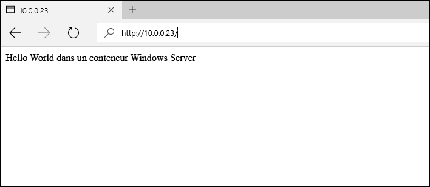

# Images de conteneur sur Windows Server

Dans le démarrage rapide précédent de Windows Server, un conteneur Windows était créé à partir d’un exemple .Net Core préalablement créé. Cet exercice explique en détail comment créer manuellement des images de conteneur personnalisées, automatiser la création d’images de conteneur à l’aide d’un fichier Dockerfile et stocker des images de conteneur dans le Registre public Docker Hub.

Ce guide de démarrage rapide concerne les conteneurs Windows Server sur Windows Server 2016 et utilise l’image de base du conteneur Windows Server Core. Une documentation de démarrage rapide supplémentaire est disponible dans la table des matières affichée à gauche dans cette page.

**Conditions préalables :**

- Un système informatique (physique ou virtuel) exécutant Windows Server 2016.
- Configurez ce système avec la fonctionnalité de conteneur Windows et Docker. Pour obtenir une procédure pas à pas décrivant ces étapes, voir [Conteneurs Windows sur Windows Server](./quick_start_windows_server.md).
- Un ID Docker, utilisé pour transférer (push) une image de conteneur vers Docker Hub. Si vous n’avez pas encore d’ID Docker, demandez-en un sur [Docker Cloud]( https://cloud.docker.com/).

## 1. Images de conteneur - Manuelle

Pour une expérience optimale, parcourez cet exercice à partir d’une interface de commande Windows (cmd.exe).

La première étape de la création manuelle d’une image de conteneur consiste à déployer un conteneur. Pour cet exemple, déployez un conteneur IIS à partir de l’image IIS précréée. Une fois le conteneur déployé, vous allez travailler dans une session d’interpréteur de commandes à partir du conteneur. La session interactive est initialisée avec l’indicateur `-it`. Pour obtenir plus de détails sur la commande Docker Run, voir [Docker Run Reference]( https://docs.docker.com/engine/reference/run/) sur Docker.com. 

> Cette étape peut prendre du temps en raison de la taille de l’image de base Windows Server Core.

```none
docker run -it -p 80:80 microsoft/iis cmd
```

Après le téléchargement, le conteneur démarre, et une session de l’interpréteur de commandes est démarrée.

Ensuite, une modification sera apportée au conteneur. Exécutez la commande suivante pour supprimer l’écran de démarrage IIS.

```none
del C:\inetpub\wwwroot\iisstart.htm
```

Exécutez également la commande suivante pour remplacer le site IIS par défaut par un nouveau site statique.

```none
echo "Hello World From a Windows Server Container" > C:\inetpub\wwwroot\index.html
```

À partir d’un autre système, accédez à l’adresse IP de l’hôte du conteneur. Vous voyez maintenant l’application « Hello World ».

**Remarque :** Si vous travaillez dans Azure, une règle de groupe de sécurité réseau doit exister pour autoriser le trafic sur le port 80. Pour plus d’informations, voir [Créer une règle dans un groupe de sécurité réseau]( https://azure.microsoft.com/en-us/documentation/articles/virtual-networks-create-nsg-arm-pportal/#create-rules-in-an-existing-nsg).



De retour dans le conteneur, quittez la session de conteneur interactive.

```none
exit
```

Le conteneur modifié peut maintenant être capturé dans une nouvelle image de conteneur. Pour ce faire, vous avez besoin du nom du conteneur. Pour le trouver, utilisez la commande `docker ps -a`.

```none
docker ps -a

CONTAINER ID     IMAGE                             COMMAND   CREATED             STATUS   PORTS   NAMES
489b0b447949     microsoft/iis   "cmd"     About an hour ago   Exited           pedantic_lichterman
```

Pour créer la nouvelle image du conteneur, utilisez la commande `docker commit`. La commande docker commit prend la forme « docker commit nom_conteneur nom_nouvelle_image ». Remarque : Remplacez le nom de conteneur indiqué dans cet exemple par le nom de conteneur réel.

```none
docker commit pedantic_lichterman modified-iis
```

Pour vérifier que la nouvelle image a été créée, utilisez la commande `docker images`.  

```none
docker images

REPOSITORY          TAG                 IMAGE ID            CREATED              SIZE
modified-iis        latest              3e4fdb6ed3bc        About a minute ago   10.17 GB
microsoft/iis       windowsservercore   c26f4ceb81db        2 weeks ago          9.48 GB
windowsservercore   10.0.14300.1000     dbfee88ee9fd        8 weeks ago          9.344 GB
windowsservercore   latest              dbfee88ee9fd        8 weeks ago          9.344 GB
```

Cette image peut maintenant être déployée. Le conteneur obtenu inclut toutes les modifications capturées.

## 2. Image de conteneur - Fichier Dockerfile

Dans l’exercice précédent, un conteneur a été manuellement créé, modifié, puis capturé dans une nouvelle image de conteneur. Docker inclut une méthode pour automatiser ce processus à l’aide d’un fichier Dockerfile. Cet exercice permet d’obtenir presque les mêmes résultats que le précédent, mais avec un processus automatisé. Pour effectuer cet exercice, vous avez besoin d’un ID Docker. Si vous n’avez pas encore d’ID Docker, demandez-en un sur [Docker Cloud]( https://cloud.docker.com/).

Sur l’hôte de conteneur, créez un répertoire `c:\build` dans lequel vous créez un fichier nommé `Dockerfile`. Remarque : Le fichier ne doit pas avoir d’extension de fichier.

```none
powershell new-item c:\build\Dockerfile -Force
```

Ouvrez le fichier Dockerfile dans le Bloc-notes.

```none
notepad c:\build\Dockerfile
```

Copiez le texte suivant dans le fichier Dockerfile, puis enregistrez ce dernier. Ces commandes indiquent à Docker de créer une image en se servant de `microsoft/iis` comme base. Le fichier Dockerfile exécute ensuite les commandes spécifiées dans l’instruction `RUN`. Dans le cas présent, le fichier index.html est mis à jour avec le nouveau contenu. 

Pour plus d’informations sur les fichiers Dockerfile, voir [Fichiers Dockerfile sur Windows](../docker/manage_windows_dockerfile.md).

```none
FROM microsoft/iis
RUN echo "Hello World - Dockerfile" > c:\inetpub\wwwroot\index.html
```

La commande `docker build` démarre le processus de génération de l’image. Le paramètre `-t` indique au processus de génération de nommer la nouvelle image `iis-dockerfile`. **Remplacez « user » par le nom d’utilisateur de votre compte Docker**. Si vous n’avez pas encore de compte Docker, demandez-en un sur [Docker Cloud]( https://cloud.docker.com/).

```none
docker build -t <user>/iis-dockerfile c:\Build
```

Une fois l’opération terminée, vous pouvez vérifier que l’image a été créée à l’aide de la commande `docker images`.

```none
docker images

REPOSITORY          TAG                 IMAGE ID            CREATED             SIZE
iis-dockerfile      latest              8d1ab4e7e48e        2 seconds ago       9.483 GB
microsoft/iis       windowsservercore   c26f4ceb81db        2 weeks ago         9.48 GB
windowsservercore   10.0.14300.1000     dbfee88ee9fd        8 weeks ago         9.344 GB
windowsservercore   latest              dbfee88ee9fd        8 weeks ago         9.344 GB
```

Maintenant, déployez un conteneur avec la commande suivante, en remplaçant « user » par votre ID Docker.

```none
docker run -d -p 80:80 <user>/iis-dockerfile ping -t localhost
```

Une fois le conteneur créé, accédez à l’adresse IP de l’hôte de conteneur. Vous devez voir l’application hello world.


De retour sur l’hôte de conteneur, utilisez `docker ps` pour obtenir le nom du conteneur, puis `docker rm` pour supprimer le conteneur. Remarque : Remplacez le nom de conteneur indiqué dans cet exemple par le nom de conteneur réel.

Obtenez le nom du conteneur.

```none
docker ps

CONTAINER ID   IMAGE            COMMAND               CREATED              STATUS              PORTS                NAMES
c1dc6c1387b9   iis-dockerfile   "ping -t localhost"   About a minute ago   Up About a minute   0.0.0.0:80->80/tcp   cranky_brown
```

Supprimez le conteneur.

```none
docker rm -f <container name>
```

## 3. docker push

Les images de conteneur Docker peuvent être stockées dans un Registre de conteneur. Une fois stockée dans un Registre, une image peut être récupérée pour être utilisée ultérieurement sur plusieurs hôtes de conteneur. Docker fournit un Registre public pour le stockage des images de conteneur sur [Docker Hub](https://hub.docker.com/).

Dans cet exercice, l’image personnalisée « Hello World » est transférée (pushed) vers votre compte sur Docker Hub.

Tout d’abord, connectez-vous à votre compte Docker en utilisant la `docker login command`.

```none
docker login

Login with your Docker ID to push and pull images from Docker Hub. If you don't have a Docker ID, head over to https://hub.docker.com to create one.

Username: user
Password: Password

Login Succeeded
```

Une fois que vous êtes connecté, vous pouvez transférer (push) l’image de conteneur vers Docker Hub. Pour ce faire, utilisez la commande `docker push`. **Remplacez « user » par votre ID Docker**. 

```none
docker push <user>/iis-dockerfile
```

L’image de conteneur peut maintenant être téléchargée à partir de Docker Hub sur n’importe quel hôte de conteneur Windows à l’aide de la commande `docker pull`. Pour ce didacticiel, nous allons supprimer l’image existante et l’extraire (pull) de Docker Hub. 

```none
docker rmi <user>/iis-dockerfile
```

L’exécution de `docker images` montre que l’image a été supprimée.

```none
docker images

REPOSITORY                TAG                 IMAGE ID            CREATED             SIZE
modified-iis              latest              51f1fe8470b3        5 minutes ago       7.69 GB
microsoft/iis             latest              e4525dda8206        3 hours ago         7.61 GB
```

Pour finir, nous pouvons utiliser la commande « docker pull » pour extraire l’image et la remettre sur l’hôte de conteneur. Remplacez « user » par le nom d’utilisateur de votre compte Docker. 

```none
docker pull <user>/iis-dockerfile
```

## Étapes suivantes

[Conteneurs Windows sur Windows 10](./quick_start_windows_10.md)


<!--HONumber=Sep16_HO4-->


