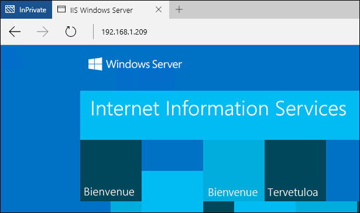

# Conteneurs Windows sur Windows Server

**Il s’agit d’un contenu préliminaire qui peut faire l’objet de modifications.**

Cet exercice vous guide lors du déploiement et l’utilisation de base de la fonctionnalité de conteneur Windows sur Windows Server. Une fois terminé, vous aurez installé le rôle de conteneur et déployé un conteneur Windows Server simple. Avant de commencer ce démarrage rapide, familiarisez-vous avec la terminologie et les concepts de base des conteneurs. Ces informations figurent dans la [Présentation du démarrage rapide](./quick_start.md).

Ce démarrage rapide est spécifique aux conteneurs Windows Server sur Windows Server 2016. Une documentation de démarrage rapide supplémentaire est disponible dans la table des matières affichée à gauche dans cette page.

**Conditions préalables :**

Un système informatique (physique ou virtuel) exécutant [Windows Server 2016 Technical Preview 5](https://www.microsoft.com/en-us/evalcenter/evaluate-windows-server-technical-preview).

Une image Windows Server entièrement configurée est disponible dans Azure. Pour utiliser cette image, déployez une machine virtuelle en cliquant sur le bouton ci-dessous. Le déploiement prendra environ 10 minutes. Une fois qu’il est terminé, connectez-vous à la machine virtuelle Azure et passez à l’étape 4 de ce didacticiel. 

<a href="https://portal.azure.com/#create/Microsoft.Template/uri/https%3A%2F%2Fraw.githubusercontent.com%2FMicrosoft%2FVirtualization-Documentation%2Fmaster%2Fwindows-server-container-tools%2Fcontainers-azure-template%2Fazuredeploy.json" target="_blank">
    
</a>

## 1. Installer la fonctionnalité de conteneur

La fonctionnalité de conteneur doit être activée avant d’utiliser des conteneurs Windows. Pour ce faire, exécutez la commande suivante dans une session PowerShell avec élévation de privilèges.

```none
Install-WindowsFeature containers
```

Une fois l’installation de la fonctionnalité terminée, redémarrez l’ordinateur.

```none
Restart-Computer -Force
```

## 2. Installer Docker

Docker est nécessaire pour utiliser les conteneurs Windows. Docker comprend le moteur Docker et le client Docker. Pour cet exercice, les deux seront installés.

Téléchargez le moteur Docker et le client au format d’archive zip.

```none
Invoke-WebRequest "https://get.docker.com/builds/Windows/x86_64/docker-1.12.0.zip" -OutFile "$env:TEMP\docker-1.12.0.zip" -UseBasicParsing
```

Développez l’archive zip dans Program Files.

```none
Expand-Archive -Path "$env:TEMP\docker-1.12.0.zip" -DestinationPath $env:ProgramFiles
```

Ajoutez le répertoire Docker au chemin du système.

```none
# for quick use, does not require shell to be restarted
$env:path += ";c:\program files\docker"

# for persistent use, will apply even after a reboot 
[Environment]::SetEnvironmentVariable("Path", $env:Path + ";C:\Program Files\Docker", [EnvironmentVariableTarget]::Machine)
```

Pour installer Docker en tant que service Windows, exécutez la commande suivante.

```none
dockerd --register-service
```

Une fois installé, le service peut être démarré.

```none
Start-Service docker
```

## 3. Installer les images de conteneur de base

Les conteneurs Windows sont déployés à partir de modèles ou d’images. Avant de pouvoir déployer un conteneur, une image de système d’exploitation de base doit être téléchargée. La commande suivante télécharge l’image de base Windows Server Core.

```none
docker pull microsoft/windowsservercore
```

Ce processus peut prendre du temps. Faites une pause, puis reprenez une fois l’extraction terminée.

Une fois l’image extraite, l’exécution de la commande `docker images` retourne une liste d’images installées ; dans le cas présent, l’image Windows Server Core.

```none
docker images

REPOSITORY                    TAG                 IMAGE ID            CREATED             SIZE
microsoft/windowsservercore   latest              02cb7f65d61b        8 weeks ago         7.764 GB
```

Pour obtenir des informations détaillées sur les images de conteneur Windows, voir la rubrique relative à la [gestion des images de conteneur](../management/manage_images.md).

## 4. Déployer votre premier conteneur

Dans cet exercice, vous allez télécharger une image IIS précréée à partir du Registre du hub Docker et déployer un conteneur simple qui exécute IIS.  

Pour rechercher des images de conteneur Windows dans le hub Docker, exécutez la commande `docker search Microsoft`.  

```none
docker search microsoft

NAME                                         DESCRIPTION
microsoft/aspnet                             ASP.NET is an open source server-side Web ...
microsoft/dotnet                             Official images for working with .NET Core...
mono                                         Mono is an open source implementation of M...
microsoft/azure-cli                          Docker image for Microsoft Azure Command L...
microsoft/iis                                Internet Information Services (IIS) instal...
microsoft/mssql-server-2014-express-windows  Microsoft SQL Server 2014 Express installe...
microsoft/nanoserver                         Nano Server base OS image for Windows cont...
microsoft/windowsservercore                  Windows Server Core base OS image for Wind...
microsoft/oms                                Monitor your containers using the Operatio...
microsoft/dotnet-preview                     Preview bits for microsoft/dotnet image
microsoft/dotnet35
microsoft/applicationinsights                Application Insights for Docker helps you ...
microsoft/sample-redis                       Redis installed in Windows Server Core and...
microsoft/sample-node                        Node installed in a Nano Server based cont...
microsoft/sample-nginx                       Nginx installed in Windows Server Core and...
microsoft/sample-httpd                       Apache httpd installed in Windows Server C...
microsoft/sample-dotnet                      .NET Core running in a Nano Server container
microsoft/sqlite                             SQLite installed in a Windows Server Core ...
...
```

Téléchargez l’image IIS à l’aide de la commande `docker pull`.  

```none
docker pull microsoft/iis
```

Le téléchargement de l’image peut être vérifié avec la commande `docker images`. Notez que vous verrez à la fois l’image de base (windowsservercore) et l’image IIS.

```none
docker images

REPOSITORY                    TAG                 IMAGE ID            CREATED             SIZE
microsoft/iis                 latest              accd044753c1        11 days ago         7.907 GB
microsoft/windowsservercore   latest              02cb7f65d61b        8 weeks ago         7.764 GB
```

Utilisez la commande `docker run` pour déployer le conteneur IIS.

```none
docker run -d -p 80:80 microsoft/iis ping -t localhost
```

Cette commande exécute l’image IIS en tant que service d’arrière-plan (-d) et configure la mise en réseau de façon à ce que le port 80 de l’hôte du conteneur soit mappé au port 80 du conteneur.
Pour obtenir des informations détaillées sur la commande Docker Run, voir [Docker Run Reference]( https://docs.docker.com/engine/reference/run/) sur Docker.com.


Les conteneurs en cours d’exécution peuvent être consultés à l’aide de la commande `docker ps`. Notez le nom du conteneur ; il sera utilisé dans une étape ultérieure.

```none
docker ps

CONTAINER ID  IMAGE          COMMAND              CREATED             STATUS             PORTS               NAME
09c9cc6e4f83  microsoft/iis  "ping -t localhost"  About a minute ago  Up About a minute  0.0.0.0:80->80/tcp  big_jang
```

À partir d’un autre ordinateur, ouvrez un navigateur web et entrez l’adresse IP de l’hôte du conteneur. Si tout a été configuré correctement, vous devez voir l’écran de démarrage d’IIS. Cela s’effectue à partir de l’instance IIS hébergée dans le conteneur Windows.

**Remarque :** Si vous travaillez dans Azure, l’adresse IP externe de la machine virtuelle et une sécurité réseau configurée seront nécessaires. Pour plus d’informations, voir [Créer une règle dans un groupe de sécurité réseau]( https://azure.microsoft.com/en-us/documentation/articles/virtual-networks-create-nsg-arm-pportal/#create-rules-in-an-existing-nsg).



De retour sur l’hôte de conteneur, utilisez la commande `docker rm` pour supprimer le conteneur. Remarque : Remplacez le nom de conteneur indiqué dans cet exemple par le nom de conteneur réel.

```none
docker rm -f big_jang
```
## Étapes suivantes

[Images de conteneur sur Windows Server](./quick_start_images.md)

[Conteneurs Windows sur Windows 10](./quick_start_windows_10.md)


<!--HONumber=Aug16_HO4-->


